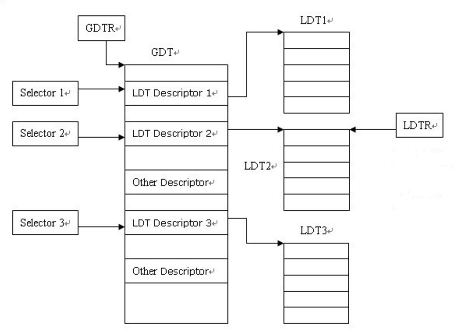

# 理论补充

## 端口操作
涉及的端口操作可以参考 http://bochs.sourceforge.net/techspec/PORTS.LST

## 故障恢复
QEMU 采用的是 SeaBIOS，正常启动和机器故障恢复都是从 0xFFFF0 处开始执行，为了区分是正常启动还是故障恢复，会在 BIOS 启动后检查某一特殊内存处的值是否为 0，如果为 0 则表示正常启动，否则为故障恢复，需要跳到特殊的执行流

## 开启保护模式
BIOS 会开启保护模式进行一系列检测，例如测试可用内存空间，在 BIOS 将控制权交给 Boot Loader 之前，会关闭保护模式，因为 Boot Loader 初始也应该运行于实模式下

进入保护模式需要进行如下 3 个步骤

### 开启 A20

#### 作用
Intel 8086/8088 采用段加偏移的方式得到的最高地址应该是 FFFF:FFFF = 0x10FFEF，一共有21位，但只有20根地址线，于是最高位被忽略得到0xFFEF，Intel 80286 在 Intel 8086/8088 的基础上多出了 A20～A23 总线，于是 0x10FFEF 将不会被省略最高位，但这就产生了兼容性问题，一些历史版本的软件想在 Intel 80286 通过以前的方式按 FFFF:FFFF 读取 0xFFEF，但会被解析为 0x10FFEF，于是默认将 A20 关闭，在需要的时候再开启

进入保护模式时需要开启，如果不开，则第 21 位会永远为 0

#### 开启方式
由于那时 8042 键盘控制器还有多余引脚，所以 A20 的打开可以通过 8042 键盘控制器的 0x60 和 0x64 端口来控制，除此之外，还可以通过 PS/2 的 0x92 端口控制

### 设置 GDTR
保护模式下，段寄存器的解释方式发生了[变化](#保护模式段寄存器)，所以需要在设置完 GDTR 后还需要重新设置段寄存器，而当执行长跳转时 CS 段寄存器会被自动改变，而其他段寄存器则需要手动改变

### 进入保护模式
将 CR0 寄存器的 PE 位（最低位）设置为 1 标志着正式进入保护模式

## MBR 载入地址
BIOS 会将 MBR 加载在 0x7C00 处，是由于早期的 8088，当时 IBM PC 5150 搭配了该CPU，使用 86-DOS 操作系统，需要的内存最少是 32KB（0x0000~0x7FFF），由于 0x0000~0x03FF 用于存储中断向量表，所以还剩 0x0400~0x7FFF，MBR 需要 512B 并且由于 Boot Loader 也会产生数据所以还要留出 512B 保存数据，所以 0x7FFF - 512 - 512 + 1 = 0x7C00

## GDT 与 LDT

### LDT
LDT 为局部描述符表（Local Descriptor Table），与 GDT 不同，系统中运行存在多个 LDT，每个任务可以有一个，并且 LDT 是嵌套在 GDT 中的，可看作 GDT 的二级表：



### GDTR 与 LDTR
* GDTR（IDTR 同） 为 6B，低 2B 表示表长，高 4B 为表的起始地址；
* LDTR 为 16bit，高 13bit 为选择子（Index），索引 LDT 在 GDT 中的位置；

### 保护模式段寄存器
保护模式下，段寄存器结构：
* 高 13bit：选择子（Index），索引段描述符在 GDT/LDT 中的位置；
* 第 3bit：选择子类型（TI），0 表示在 GDT 中选择，1 表示在 LDT 中选择；
* 低 2bit：请求特权级（RPL），其中 CS 段的 RPL 被称为 CPL，即当前特权环，段描述符的 DPL >= max(CPL, RPL) 表示可访问该段；

## MMU
MMU 属于体系结构层次，对操作系统而言，只需要将页目录地址载入 CR3 寄存器即可

## 硬盘 LBA 寻址
CHS（Cylinders-Heads-Sectors）即以柱面、磁头、扇区为单位寻址，而逻辑区块地址（Logical Block Address）以扇区号为单位寻址，其涉及端口为 0x1F0~0x1F7

## CPU 等待
0x84 端口是 Extra Page Register，读这个寄存器的指令实际相当于一个 NOOP，可以通过该操作实现底层的 CPU 等待

## 符号表
一些类型的符号在符号表中的地址是递增的，如 FUN、SO 等，因为这类符号的地址就是 EIP，而 SLINE 在符号表中不是严格递增的，因为其地址为到函数的偏移，仅在同一函数范围内地址是递增的

# 代码解析

## BIOS
在一个终端`make qemu-gdb`后在另一个终端`make gdb`，通过`si`不断查看后续指令：
```asm
# 第一条 BIOS 指令
[f000:fff0]    0xffff0:	ljmp   $0xf000,$0xe05b

# 检查故障恢复
[f000:e05b]    0xfe05b:	cmpl   $0x0,%cs:0x60b8
[f000:e062]    0xfe062:	jne    0xfd11f

# 清零 SS
[f000:e066]    0xfe066:	xor    %dx,%dx # 自身和自身 xor 为 0
[f000:e068]    0xfe068:	mov    %dx,%ss

# 设置栈顶寄存器
[f000:e06a]    0xfe06a:	mov    $0x7000,%esp

# 为后续 0xfcfe5 处 jmp *%edx
[f000:e070]    0xfe070:	mov    $0xf18d6,%edx
[f000:e076]    0xfe076:	jmp    0xfcf99

# 禁用 NMI
[f000:cf99]    0xfcf99:	cli
[f000:cf9a]    0xfcf9a:	cld
[f000:cf9b]    0xfcf9b:	mov    %eax,%ecx
[f000:cf9e]    0xfcf9e:	mov    $0x8f,%eax
[f000:cfa4]    0xfcfa4:	out    %al,$0x70
[f000:cfa6]    0xfcfa6:	in     $0x71,%al

# 开启 A20
[f000:cfa8]    0xfcfa8:	in     $0x92,%al
[f000:cfaa]    0xfcfaa:	or     $0x2,%al
[f000:cfac]    0xfcfac:	out    %al,$0x92
[f000:cfae]    0xfcfae:	mov    %ecx,%eax

# 设置 IDTR、GDTR
[f000:cfb1]    0xfcfb1:	lidtw  %cs:0x60a8
[f000:cfb7]    0xfcfb7:	lgdtw  %cs:0x6068

# 开启保护模式
[f000:cfbd]    0xfcfbd:	mov    %cr0,%ecx
[f000:cfc0]    0xfcfc0:	and    $0x1fffffff,%ecx # ？？？
[f000:cfc7]    0xfcfc7:	or     $0x1,%ecx
[f000:cfcb]    0xfcfcb:	mov    %ecx,%cr0

# 重设段寄存器
[f000:cfce]    0xfcfce:	ljmpl  $0x8,$0xfcfd6
0xfcfd6:	mov    $0x10,%ecx
0xfcfdb:	mov    %ecx,%ds
0xfcfdd:	mov    %ecx,%es
0xfcfdf:	mov    %ecx,%ss

# 进行后续工作
0xfcfe5:	jmp    *%edx
...
```

## Boot Loader
Boot Loader 的代码位于  bootboot.S：
```assembly
# 定义一些常量
.set PROT_MODE_CSEG, 0x8
.set PROT_MODE_DSEG, 0x10
.set CR0_PE_ON,      0x1

.globl start
start:
  .code16 # 之后的指令类型为16-bit
  cli     # Boot Loader 的第一条指令（0x7C00）
  cld

  # 将除 CS 外的段寄存器清零
  xorw    %ax,%ax
  movw    %ax,%ds
  movw    %ax,%es
  movw    %ax,%ss
  
# 开启A20:
seta20.1:
  inb     $0x64,%al
  testb   $0x2,%al
  jnz     seta20.1

  movb    $0xd1,%al
  outb    %al,$0x64

seta20.2:
  inb     $0x64,%al
  testb   $0x2,%al
  jnz     seta20.2

  movb    $0xdf,%al
  outb    %al,$0x60
  
  # 设置 GDTR
  lgdt    gdtdesc
```
其中``gdtdesc``在 boot.S 末尾：
```assembly
.p2align 2 # 4B 内存对其
gdt:                                    
  SEG_NULL                          # null段
  SEG(STA_X|STA_R, 0x0, 0xffffffff) # 代码段（访问权限、段起始，段大小界限）
  SEG(STA_W, 0x0, 0xffffffff)       # 数据段（JOS 只用段进行权限控制而未独立划分内存区域）

gdtdesc:
  .word   0x17 # GDT 大小 - 1
  .long   gdt  # GDT 起始地址
```
其中`SEG_NULL`和`SEG`定义在 inc/mmu.h 中：

```c
#define SEG_NULL     \
        .word 0, 0;  \
        .byte 0, 0, 0, 0
#define SEG(type,base,lim)                                      \
        .word (((lim) >> 12) & 0xffff), ((base) & 0xffff);      \
        .byte (((base) >> 16) & 0xff), (0x90 | (type)),         \
                (0xC0 | (((lim) >> 28) & 0xf)), (((base) >> 24) & 0xff)
```
接着通过如下步骤完成从实模式到保护模式的切换：
```assembly
  movl    %cr0, %eax
  orl     $CR0_PE_ON, %eax
  movl    %eax, %cr0

  ljmp    $PROT_MODE_CSEG, $protcseg
  
	.code32 # 之后的指令类型为32-bit
protcseg:
  movw    $PROT_MODE_DSEG, %ax
  movw    %ax, %ds
  movw    %ax, %es
  movw    %ax, %fs
  movw    %ax, %gs
  movw    %ax, %ss
```
最后完成内核的加载：
```assembly
  movl    $start, %esp    # 设置栈顶，为接下来 C 函数调用做准备
  call bootmain           # 因为不再返回，无需对返回地址压栈
```
接着查看 boot/main.c 中的内容：
```c
#include <inc/x86.h>
#include <inc/elf.h>
#define SECTSIZE	512
#define ELFHDR		((struct Elf *) 0x10000)

void
bootmain(void)
{
	struct Proghdr *ph, *eph;

  // 从硬盘加载 1 block 的内核映像 ELF 头到 ELFHDR 处
	readseg((uint32_t) ELFHDR, SECTSIZE*8, 0);

	// 判断是否为合法 ELF
	if (ELFHDR->e_magic != ELF_MAGIC)
		goto bad;

	// 从硬盘加载每个程序段
	ph = (struct Proghdr *) ((uint8_t *) ELFHDR + ELFHDR->e_phoff);
	eph = ph + ELFHDR->e_phnum;
	for (; ph < eph; ph++)
		readseg(ph->p_pa, ph->p_memsz, ph->p_offset);

	// 将控制权交给内核
	((void (*)(void)) (ELFHDR->e_entry))();

bad:
	outw(0x8A00, 0x8A00);
	outw(0x8A00, 0x8E00);
	while (1)
		/* do nothing */;
}

void
readseg(uint32_t pa, uint32_t count, uint32_t offset)
{
	uint32_t end_pa;
	
	// 计算结束地址(内存)
	end_pa = pa + count;

	// 根据扇区大小做内存对齐
	pa &= ~(SECTSIZE - 1);

  // 将字节偏移转为扇区偏移，扇区编号从 1 开始，0 号为 MBR
	offset = (offset / SECTSIZE) + 1;

	// 不断调用 readsect 读取硬盘第 offset 号扇区到 pa
	while (pa < end_pa) {
		readsect((uint8_t*) pa, offset);
		pa += SECTSIZE;
		offset++;
	}
}

void
waitdisk(void)
{
	while ((inb(0x1F7) & 0xC0) != 0x40)
		/* do nothing */;
}

void
readsect(void *dst, uint32_t offset)
{
	// 等待磁盘空闲
	waitdisk();

  // LBA 寻址
	outb(0x1F2, 1);
	outb(0x1F3, offset);
	outb(0x1F4, offset >> 8);
	outb(0x1F5, offset >> 16);
	outb(0x1F6, (offset >> 24) | 0xE0);
	outb(0x1F7, 0x20);

	// 等待操作结束
	waitdisk();

	// 将硬盘数据传入内存 dst，传输 SECTSIZE/4 次（每次传 4B）
	insl(0x1F0, dst, SECTSIZE/4);
}
```
如下是`insl`实际执行的汇编，函数参数传递统一都是压栈而没有使用寄存器：

```assembly
    mov    0x8(%ebp),%edi   # dst 存入 EDI
    mov    $0x80,%ecx       # SECTSIZE/4 存入 ECX（repnz 的循环次数）
    mov    $0x1f0,%edx
    cld
    repnz insl (%dx),%es:(%edi)   # 循环：从 0x1f0 到 dst 每次传 4B（dst 每轮后移 4B）
```

## Kernel

### 临时页表
利用`objdump -h obj/kern/kernel`查看内核的 ELF 信息：
```
obj/kern/kernel:	file format ELF32-i386

Sections:
Idx Name          Size     VMA              LMA              Type
  0               00000000 0000000000000000 0000000000000000 
  1 .text         0000178e 00000000f0100000 0000000000100000 TEXT 
  2 .rodata       00000704 00000000f01017a0 00000000001017a0 DATA 
  3 .stab         000044e9 00000000f0101ea4 0000000000101ea4 DATA 
  4 .stabstr      00008c54 00000000f010638d 000000000010638d 
  5 .data         0000a300 00000000f010f000 000000000010f000 DATA 
  6 .bss          00000648 00000000f0119300 0000000000119300 DATA 
  7 .comment      00000011 0000000000000000 0000000000000000 
  8 .shstrtab     0000004c 0000000000000000 0000000000000000 
  9 .symtab       00000650 0000000000000000 0000000000000000 
 10 .strtab       00000369 0000000000000000 0000000000000000 
```
可以看到，其 VMA 比 LMA 高了 0xF0000000，所以在 kern/entry.S 一开始进行如下设置，从而保证入口地址正确：
```asm
#define	RELOC(x) ((x) - KERNBASE) // KERNBASE 定义于 memlayout.h，为 0xF0000000
_start = RELOC(entry)
```
为了保证接下来的执行都不会因 VMA 和 LMA 的不同而发生错误，需要尽快开启虚拟内存到物理内存映射：
```asm
# 将页目录地址载入 CR3
movl	$(RELOC(entry_pgdir)), %eax
movl	%eax, %cr3

# 开启页表映射
movl	%cr0, %eax
orl	$(CR0_PE|CR0_PG|CR0_WP), %eax
movl	%eax, %cr0

# EIP 当前在 [0, 4M)，跳转到 [KERNBASE, KERNBASE+4M)
mov	$relocated, %eax
jmp	*%eax
```
其中`entry_pgdir`定义于 kern/entrygdir.c：
```c
#include <inc/mmu.h>
#include <inc/memlayout.h>

pte_t entry_pgtable[NPTENTRIES];

// 页目录
__attribute__((__aligned__(PGSIZE)))
pde_t entry_pgdir[NPDENTRIES] = {
	// 虚拟内存 [0, 4MB)，映射到二级页表 entry_pgtable
  // entry_pgtable PGSIZE 对齐，后 12bit 为 0，可用 + 代替 |
	[0]
		= ((uintptr_t)entry_pgtable - KERNBASE) + PTE_P,
	// 虚拟内存 [KERNBASE, KERNBASE+4MB)，映射到二级页表 entry_pgtable
	[KERNBASE>>PDXSHIFT]
		= ((uintptr_t)entry_pgtable - KERNBASE) + PTE_P + PTE_W
};

// 二级页表
__attribute__((__aligned__(PGSIZE)))
pte_t entry_pgtable[NPTENTRIES] = {
  0x000000 | PTE_P | PTE_W, // 虚拟内存 [0, 4KB)，映射为物理内存 [0, 4KB)
	0x001000 | PTE_P | PTE_W, // 虚拟内存 [4, 8KB)，映射为物理内存 [4, 8KB)
  ...
```
仅能完成有限的映射，这只是为了保证内核能支持接下来代码正常执行的临时页表，其中`entry_pgtable - KERNBASE`与`RELOC`作用一样。并且因为将虚拟地址的 [0, 4MB) 映射到了物理地址的 [0, 4MB)，所以在开启页表映射后，进行`jmp`之前，EIP 即便保持在 [0, 4MB) 也能继续执行不会出错

### printf
kern\console.c 中`cputchar`向终端显示单个字符，其涉及的关键实现如下：
```c
static uint16_t *crt_buf; // 显示缓冲区
static uint16_t crt_pos;  // 光标位置

static void
cga_putc(int c)
{
  // 1B 以上的高位控制着字符的前景/背景色
	// 如果没有设定，则默认白底黑字
	if (!(c & ~0xFF))
		c |= 0x0700;

	switch (c & 0xff) {
	case '\b': // 退格
		if (crt_pos > 0) {
			crt_pos--;
			crt_buf[crt_pos] = (c & ~0xff) | ' ';
		}
		break;
	case '\n': // 回车
		crt_pos += CRT_COLS;
		/* fallthru */
	case '\r': // 光标移到本行最前
		crt_pos -= (crt_pos % CRT_COLS);
		break;
	case '\t': // TAB
		cons_putc(' ');
		cons_putc(' ');
		cons_putc(' ');
		cons_putc(' ');
		cons_putc(' ');
		break;
	default: // 普通字符
		crt_buf[crt_pos++] = c;
		break;
	}

	// 屏幕写满，消除首行，其他行上移
	if (crt_pos >= CRT_SIZE) {
		int i;
    
		memmove(crt_buf, crt_buf + CRT_COLS, (CRT_SIZE - CRT_COLS) * sizeof(uint16_t));
		for (i = CRT_SIZE - CRT_COLS; i < CRT_SIZE; i++)
			crt_buf[i] = 0x0700 | ' ';
		crt_pos -= CRT_COLS;
	}

	// 将缓冲区刷到 CGA 上
	outb(addr_6845, 14);
	outb(addr_6845 + 1, crt_pos >> 8);
	outb(addr_6845, 15);
	outb(addr_6845 + 1, crt_pos);
}

static void
cons_putc(int c)
{
	serial_putc(c); // 向串口输出
	lpt_putc(c);    // 向并口输出
	cga_putc(c);    // 向 CGA 输出
}

void
cputchar(int c)
{
	cons_putc(c);
}
```
kern/printf.c 中的`cprintf`用于实现向终端格式化输出字符串，涉及的关键实现如下：
```c
static void
putch(int ch, int *cnt)
{
	cputchar(ch);
	*cnt++;
}

int
vcprintf(const char *fmt, va_list ap)
{
	int cnt = 0; // 统计打印的字符总数

	vprintfmt((void*)putch, &cnt, fmt, ap);
	return cnt;
}

int
cprintf(const char *fmt, ...)
{
	va_list ap;
	int cnt;

	va_start(ap, fmt);
	cnt = vcprintf(fmt, ap);
	va_end(ap);

	return cnt;
}
```
其中`vprintfmt`定义于 lib/printfmt.c，涉及的关键实现如下，并且该文件下的`printfmt`也能实现向终端格式化输出字符串：
```c
static void
printnum(void (*putch)(int, void*), void *putdat,
	 unsigned long long num, unsigned base, int width, int padc)
{
	// 截断低位，递归高位
	if (num >= base) {
		printnum(putch, putdat, num / base, base, width - 1, padc);
	} else {
		// 到达最高位，处理右对齐，向左填充
		while (--width > 0)
			putch(padc, putdat);
	}

	// 打印当前位
	putch("0123456789abcdef"[num % base], putdat);
}

static unsigned long long
getuint(va_list *ap, int lflag)
{
	if (lflag >= 2)
		return va_arg(*ap, unsigned long long);
	else if (lflag)
		return va_arg(*ap, unsigned long);
	else
		return va_arg(*ap, unsigned int);
}

static long long
getint(va_list *ap, int lflag)
{
	if (lflag >= 2)
		return va_arg(*ap, long long);
	else if (lflag)
		return va_arg(*ap, long);
	else
		return va_arg(*ap, int);
}

void printfmt(void (*putch)(int, void*), void *putdat, const char *fmt, ...);

void
vprintfmt(void (*putch)(int, void*), void *putdat, const char *fmt, va_list ap)
{
	register const char *p;
	register int ch, err;
	unsigned long long num;
	int base, lflag, width, precision, altflag;
	char padc;

	while (1) {
    // 一直输出，直到遇到 %
		while ((ch = *(unsigned char *) fmt++) != '%') {
			if (ch == '\0')
				return;
			putch(ch, putdat);
		}

		padc = ' ';     // 对齐方式 / 填充字符
		width = -1;     // 对齐宽度
		precision = -1; // 小数精度 / 字符串长度
		lflag = 0;      // 判断是 %l 还是 %ll
		altflag = 0;
	reswitch:
		switch (ch = *(unsigned char *) fmt++) { // % 后跟的字符

		case '-':
			padc = '-';
			goto reswitch;

		case '0':
			padc = '0';
			goto reswitch;

    // 在这获取的可能是 precision，也可能是 width
		case '1':
		case '2':
		case '3':
		case '4':
		case '5':
		case '6':
		case '7':
		case '8':
		case '9':
      // 字符串转数字到 precision
			for (precision = 0; ; ++fmt) {
				precision = precision * 10 + ch - '0';
				ch = *fmt;
				if (ch < '0' || ch > '9')
					break;
			}
			goto process_precision;

		case '*':
			precision = va_arg(ap, int);
			goto process_precision;

		case '.':
			if (width < 0)
				width = 0; // 为了 process_precision 处的判断
			goto reswitch;

		case '#':
			altflag = 1;
			goto reswitch;

		process_precision:
			if (width < 0) // 获取是 width
				width = precision, precision = -1;
			goto reswitch;

		case 'l':
			lflag++;
			goto reswitch;

		case 'c':
			putch(va_arg(ap, int), putdat); // va_arg 不能获取 char
			break;

		// 打印错误
		case 'e':
			err = va_arg(ap, int);
			if (err < 0)
				err = -err;
			if (err >= MAXERROR || (p = error_string[err]) == NULL) // 错误号未知
				printfmt(putch, putdat, "error %d", err);
			else
				printfmt(putch, putdat, "%s", p);
			break;

		case 's':
			if ((p = va_arg(ap, char *)) == NULL)
				p = "(null)";
      // 若右对齐，左边填充
			if (width > 0 && padc != '-')
				for (width -= strnlen(p, precision); width > 0; width--)
					putch(padc, putdat);
      // 打印字符串
			for (; (ch = *p++) != '\0' && (precision < 0 || --precision >= 0); width--)
				if (altflag && (ch < ' ' || ch > '~'))
					putch('?', putdat);
				else
					putch(ch, putdat);
      // 若左对齐，右边填充
			for (; width > 0; width--)
				putch(' ', putdat);
			break;

		case 'd':
			num = getint(&ap, lflag);
      // 处理负号
			if ((long long) num < 0) { // 因为 num 为 unsigned，所以强转
				putch('-', putdat);
				num = -(long long) num;
			}
			base = 10;
			goto number;

		case 'u':
			num = getuint(&ap, lflag);
			base = 10;
			goto number;

		case 'o':
			// Replace this with your code.
			// putch('X', putdat);
			// putch('X', putdat);
			// putch('X', putdat);
      putch('0', putdat);
      num = getuint(&ap, lflag);
      base = 8;
			break;

		case 'p':
			putch('0', putdat);
			putch('x', putdat);
			num = (unsigned long long)
				(uintptr_t) va_arg(ap, void *);
			base = 16;
			goto number;

		case 'x':
			num = getuint(&ap, lflag);
			base = 16;
		number:
			printnum(putch, putdat, num, base, width, padc);
			break;

		case '%':
			putch(ch, putdat);
			break;

		// 如果无法识别，则回退到 % 处，由之前的 while 把该模式直接作为字符串打印
		default:
			putch('%', putdat);
			for (fmt--; fmt[-1] != '%'; fmt--)
				/* do nothing */;
			break;
		}
	}
}

void
printfmt(void (*putch)(int, void*), void *putdat, const char *fmt, ...)
{
	va_list ap;

	va_start(ap, fmt);
	vprintfmt(putch, putdat, fmt, ap);
	va_end(ap);
}
```

### 初始化
kern/entry.S 在开启页表映射后，紧接着执行了如下代码：
```asm
relocated:
	movl	$0x0,%ebp
	movl	$(bootstacktop),%esp # 设置栈，为接下来 C 函数调用做准备
	call	i386_init
```
在 kern/entry.S 末尾利用如下代码预留了栈空间：
```asm
bootstack:
	.space		KSTKSIZE
	.globl		bootstacktop   
bootstacktop:
```
`i386_init`位于 kern/init.c，其作用是执行一些初始化工作后跳转到命令行：
```c
void
i386_init(void)
{
	extern char edata[], end[];

  // BSS 段清零
	memset(edata, 0, end - edata);

	// 初始化串口、并口、CGA，在此之后就能使用 cprintf 了
	cons_init();

  // For Lab 1 Exercise 8
	cprintf("\n6828 decimal is %o octal!\n", 6828);

	// For Lab 1 Exercise 10, 11
	test_backtrace(5);

	// 进入命令行
	while (1)
		monitor(NULL);
}
```
其中`edata`和`end`定义于 kern/kernel.dl 中，标记了 BSS 的起始和终止位置：
```
.bss : {
		PROVIDE(edata = .);
		*(.bss)
		PROVIDE(end = .);
		BYTE(0)
	}
```

### Debug
kern/monitor.c 中的`mon_backtrace`提供了打印当前调用栈的功能：
```
Stack backtrace:
  ebp f0117f18 eip f0100087 args 00000000 00000000 00000000 00000000 f010092c
         kern/init.c:18: test_backtrace+71
  ebp f0117f38 eip f0100069 args 00000000 00000001 f0117f78 00000000 f010092c
         kern/init.c:16: test_backtrace+41
```
其实现如下：
```c
int
mon_backtrace(int argc, char **argv, struct Trapframe *tf)
{
	// Your code here.
	struct Eipdebuginfo info;
	int *ebp = (int *)read_ebp();
	
	cprintf("Stack backtrace:\n");
	while (ebp != NULL) // initial ebp was 0x0
	{
    // 打印 EBP、EIP
		int eip = *(ebp + 1) ;
		cprintf ("  ebp %08x eip %08x args", ebp, eip);
		
    // 打印 5 个函数参数
		for (int i=1; i<=5; i++)
			cprintf (" %08x", *(ebp + i + 1)) ;
		cprintf ("\n") ;
		
    // 打印所在的文件、函数、行号等信息
		debuginfo_eip(eip, &info);
		cprintf ("         %s:%d: %.*s+%d\n", info.eip_file, info.eip_line, 
			info.eip_fn_namelen, info.eip_fn_name, eip - info.eip_fn_addr);

		ebp = (int *)(*ebp) ;
	}
	
	return 0;
}
```
其中`debuginfo_eip`定义于 kern/kdebug.c 中，可以在给定指令 EIP 的情况下，利用符号表导出详细信息。在 kern/kernel.dl 中通过如下代码将符号表的起始和终止位置标记为了`__STAB_BEGIN__`和`__STAB_END__`：
```
.stab : {
		PROVIDE(__STAB_BEGIN__ = .);
		*(.stab);
		PROVIDE(__STAB_END__ = .);
		BYTE(0)		/* Force the linker to allocate space
				   for this section */
	}
```
在 inc/stab.h 中定义了符号表项的结构：
```c
struct Stab {
	uint32_t n_strx;    // 符号名称索引
	uint8_t n_type;     // 符号类型
	uint8_t n_other;    // 保留，通常为 0
	uint16_t n_desc;    // 符号所在文件的行号
	uintptr_t n_value;	// 符号 EIP
};
```
在 kern/kernel.dl 中通过如下代码将符号名称表的起始和终止位置标记为了`__STABSTR_BEGIN__`和`__STABSTR_END__`：
```
.stabstr : {
		PROVIDE(__STABSTR_BEGIN__ = .);
		*(.stabstr);
		PROVIDE(__STABSTR_END__ = .);
		BYTE(0)		/* Force the linker to allocate space
				   for this section */
	}
```
`debuginfo_eip`的具体实现：
```c
// 功能：在符号表中二分查找指定符号
// 参数：符号表、查找区间（符号表下标）、符号类型、符号 EIP
// 查找成功：
//     region_left：该符号在符号表的索引
//     region_right：下一个同类型符号的索引 - 1
// 查找失败（存在同类型符号）：
//     region_left：上一个同类型符号的索引
//     region_right：下一个同类型符号的索引 - 1
// 查找失败（不存在同类型符号）：
//     region_right < region_left
static void
stab_binsearch(const struct Stab *stabs, int *region_left, int *region_right,
	       int type, uintptr_t addr)
{
	int l = *region_left, r = *region_right, any_matches = 0;

	while (l <= r) {
		int true_m = (l + r) / 2, m = true_m;

		// 在 [l, true_m] 中线性扫描，看是否有 type 匹配的
		while (m >= l && stabs[m].n_type != type)
			m--;
		if (m < l) {	// [l, true_m] 中没有 type 匹配的
			l = true_m + 1;
			continue;
		}

		// [l, true_m] 中存在 type 匹配的，为 m
		any_matches = 1;
    // 要找的符号在 m 后
		if (stabs[m].n_value < addr) {
			*region_left = m; // 以防查找失败（存在同类型符号）
			l = true_m + 1;   // [m, true_m] 都没有 type 匹配的，所以在 true_m 后
    // 要找的符号在 m 前
		} else if (stabs[m].n_value > addr) {
			*region_right = m - 1;
			r = m - 1;
    // 找到了符号，但仍需继续确定右边界
		} else {
			*region_left = m;
			// l = m;
			// addr++;
      // 自改，上述代码存在 BUG，既会导致 [m, true_m] 被重复扫，又会在 addr + 1
      // 也为 type 时引起 region_left 的更新从而定位到了错误的符号，修改避免了对
      // [m, true_m] 的重复扫，且在剩余的 [true_m + 1, r] 的区间中不可能出现小
      // 于等于 addr 的同类符号了，region_left 不会再有任何更新
      l = true_m + 1;
		}
	}

  // 查找失败（不存在同类型符号）
	if (!any_matches)
		*region_right = *region_left - 1;
  // 自改，该代码无意义
	//else {
	//	for (l = *region_right;
	//	     l > *region_left && stabs[l].n_type != type;
	//	     l--)
  //    	/* do nothing */;
	//	*region_left = l;
	//}
}

int
debuginfo_eip(uintptr_t addr, struct Eipdebuginfo *info)
{
	const struct Stab *stabs, *stab_end;
	const char *stabstr, *stabstr_end;
	int lfile, rfile, lfun, rfun, lline, rline;

	// 初始化 info，以处理未找到直接返回的情况
	info->eip_file = "<unknown>";
	info->eip_line = 0;
	info->eip_fn_name = "<unknown>";
	info->eip_fn_namelen = 9; // <unknown> 的长度
	info->eip_fn_addr = addr;
	info->eip_fn_narg = 0;

  // addr 在内核地址空间
	if (addr >= ULIM) {
		stabs = __STAB_BEGIN__;
		stab_end = __STAB_END__;
		stabstr = __STABSTR_BEGIN__;
		stabstr_end = __STABSTR_END__;
	} else {
		// addr 在用户地址空间
		panic("User address");
	}

	// 符号名称表有误
	if (stabstr_end <= stabstr || stabstr_end[-1] != 0)
		return -1;

	// 查找 EIP 所在文件
	lfile = 0;
	rfile = (stab_end - stabs) - 1;
	stab_binsearch(stabs, &lfile, &rfile, N_SO, addr);
	if (lfile == 0) // 0 是 stdin
		return -1;

	// 查找 EIP 所在函数
	lfun = lfile;
	rfun = rfile;
	stab_binsearch(stabs, &lfun, &rfun, N_FUN, addr);

  // 查找成功
	if (lfun <= rfun) {
		// 从符号名称表中取得函数名
		if (stabs[lfun].n_strx < stabstr_end - stabstr)
			info->eip_fn_name = stabstr + stabs[lfun].n_strx;
    // 记录函数 EIP
		info->eip_fn_addr = stabs[lfun].n_value;
    // 将 addr 修改为函数内偏移，为接下来行号查询
		// addr -= info->eip_fn_addr;  // 存在 BUG
    addr -= info->eip_fn_addr + 1; // 自改
		lline = lfun;
		rline = rfun;
	} else {
		// 无法找到函数，可能查询区间处于汇编文件内
		info->eip_fn_addr = addr;
    addr-- ; // 自改，否则存在 BUG
		lline = lfile;
		rline = rfile;
	}
	// 将函数名中多余的部分删去
	info->eip_fn_namelen = strfind(info->eip_fn_name, ':') - info->eip_fn_name;

	// 查找 EIP 所在文件的行号
	// Your code here.
  stab_binsearch(stabs, &lline, &rline, N_SLINE, addr);
  if (lline <= rline)
		info->eip_line = stabs[lline].n_desc ;
	else
		return -1 ;

	// 函数可能是来自其他文件的 inline 函数（这样的文件符号类型为 N_SOL），
  // 于是当前定位的文件不一定准确，从当前位置往前扫，尝试重新定位文件
	while (lline >= lfile
	       && stabs[lline].n_type != N_SOL
	       && (stabs[lline].n_type != N_SO || !stabs[lline].n_value))
		lline--;
  // 从符号名称表中取得文件名
	if (lline >= lfile && stabs[lline].n_strx < stabstr_end - stabstr)
		info->eip_file = stabstr + stabs[lline].n_strx;

	// 确定函数参数的个数（函数参数符号类型为 N_PSYM）
	if (lfun < rfun)
		for (lline = lfun + 1;
		     lline < rfun && stabs[lline].n_type == N_PSYM;
		     lline++)
			info->eip_fn_narg++;

	return 0;
}
```

### 命令行
kern/minitor.c 中的`monitor`提供了命令行：
```c
void
monitor(struct Trapframe *tf)
{
	char *buf;

	cprintf("Welcome to the JOS kernel monitor!\n");
	cprintf("Type 'help' for a list of commands.\n");


	while (1) {
		buf = readline("K> "); // 获取命令
		if (buf != NULL)
			if (runcmd(buf, tf) < 0) // 执行命令，命令返回 -1 则终止 monitor
				break;
	}
}
```
其中`runcmd`如下：
```c
struct Command {
	const char *name; // 命令名
	const char *desc; // 命令描述
	// 执行命令的函数
	int (*func)(int argc, char** argv, struct Trapframe* tf);
};

// 当前支持的命令集合
static struct Command commands[] = {
	{ "help", "Display this list of commands", mon_help },
	{ "kerninfo", "Display information about the kernel", mon_kerninfo },
	{ "backtrace", "Stack backtrace:", mon_backtrace }, // For Lab1 Exercise 12
};

#define WHITESPACE "\t\r\n "
#define MAXARGS 16

static int
runcmd(char *buf, struct Trapframe *tf)
{
	int argc;
	char *argv[MAXARGS];
	int i;

	// 解析命令参数，其中命令名为第一个参数
	argc = 0;
	argv[argc] = 0;
	while (1) {
		// 跳过空白符（将其都替换成 \0）
		while (*buf && strchr(WHITESPACE, *buf))
			*buf++ = 0;
		if (*buf == 0)
			break;

		// 参数个数超限
		if (argc == MAXARGS-1) {
			cprintf("Too many arguments (max %d)\n", MAXARGS);
			return 0;
		}
		// 保存参数起始地址
		argv[argc++] = buf;
		// 跳过当前参数剩余字符
		while (*buf && !strchr(WHITESPACE, *buf))
			buf++;
	}
	argv[argc] = 0;
  
	// 没有任何有效参数
	if (argc == 0)
		return 0;
  // 检索所有命令，如有匹配则执行对应函数
	for (i = 0; i < ARRAY_SIZE(commands); i++) {
		if (strcmp(argv[0], commands[i].name) == 0)
			return commands[i].func(argc, argv, tf);
	}
  // 没有检索到任何匹配命令
	cprintf("Unknown command '%s'\n", argv[0]);
	return 0;
}
```


# Exercises
对于在[代码解析](#代码解析)部分已经有阐述或对加深理解意义不大的 Exercise 不做赘述

## Exercise 3
> What is the last instruction of the boot loader executed, and what is the first instruction of the kernel it just loaded?

在 obj/boot/boot.asm 中找到 C 语言`((void (*)(void)) (ELFHDR->e_entry))();`对应的汇编：
```asm
call   *0x10018
```

> Where is the first instruction of the kernel?

在 kern/entry.S 中可以看到，第一行被执行的代码如下：
```asm
movw   $0x1234,0x472
```

## Exercise 5
> Exercise 5.Trace through the first few instructions of the boot loader again and identify the first instruction that would "break" or otherwise do the wrong thing if you were to get the boot loader's link address wrong. Then change the link address inboot/Makefragto something wrong, runmake clean, recompile the lab withmake, and trace into the boot loader again to see what happens. Don't forget to change the link address back andmake cleanagain afterward!

将 boot/Makefrag 第 28 行处的装载地址由 0x7c00 修改为 0x8c00，重新编译后通过`objdump -h obj/boot.out`可以看到其 VMA/LMA 一致变为 0x8c00，但 BIOS 在装载 Boot Loader 时会忽略 LMA 仍按照惯例将其加载到 0x7c00，即 Boot Loader 的实际装载地址与 VMA 不一致，而 Boot Loader 链接时会以 VMA 来计算标识符地址，如`gdt`实际为 0x7c4c，但却在链接时被计算为 0x8c4c，所以指令`lgdt gdtdesc`会给 GDTR 指定一个错误的地址

## Exercise 8
> In the following code, what is going to be printed after 'y='? (note: the answer is not a specific value.) Why does this happen?
```c
cprintf("x=%d y=%d", 3);
```

未定义行为，会在栈中读取到一个不确定的数值

> Let's say that GCC changed its calling convention so that it pushed arguments on the stack in declaration order, so that the last argument is pushed last. How would you have to change cprintf or its interface so that it would still be possible to pass it a variable number of arguments?

由于`cprintf`需要先获取`fmt`，可变参数留在栈中按需取出，但如果此时`fmt`在栈底而可变参数在栈顶，就无法优先将`fmt`取出，所以此时`cprintf`应该将`fmt`作为最后的参数传入

## Exercise 9
> Exercise 9. Determine where the kernel initializes its stack, and exactly where in memory its stack is located. How does the kernel reserve space for its stack? And at which "end" of this reserved area is the stack pointer initialized to point to?

在 obj/kern/kernel.asm 中找到`movl	$(bootstacktop),%esp`对应于：
```asm
mov    $0xf0118000,%eax
```
而栈大小`KSTKSIZE`定义于 inc/memlayout.h，为 8 * 4096B ，所以栈的内存布局为 0xf0110000~0xf0118000

## Exercise 11
> Exercise 11. Implement the backtrace function as specified above. Use the same format as in the example, since otherwise the grading script will be confused. When you think you have it working right, run make grade to see if its output conforms to what our grading script expects, and fix it if it doesn't. After you have handed in your Lab 1 code, you are welcome to change the output format of the backtrace function any way you like.

在`test_backtrace`递归到尽头时，利用`mon_backtrace`打印调用栈信息：
```c
void
test_backtrace(int x)
{
    cprintf("entering test_backtrace %d\n", x);
    if (x > 0)
        test_backtrace(x-1);
    else // 递归到尽头
        mon_backtrace(0, 0, 0);
    cprintf("leaving test_backtrace %d\n", x);
}
```