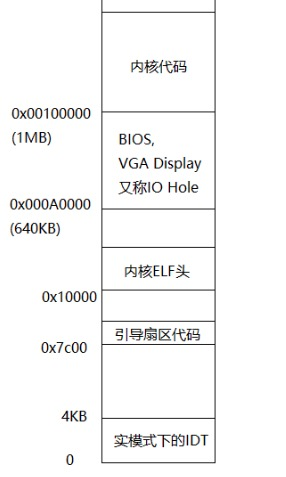

# 理论补充

## CMOS
CMOS 是用于保存 BIOS 设置的 RAM，由独立电池供电

## 内存布局

### 物理内存
经过 Lab 1，物理内存布局如下：



* 0x00000~0xA0000：basemem，其中 ELF 头、Boot Loader 在后期用不上了，可以被覆盖；
* 0xA0000~0x100000：IO Hole，不可用；
* 0x100000 以上：extmem，通过`objdump -h obj/kern/kernel`可以发现 BSS 是内核所占的最后一段，所以 BSS 后的内存是未使用的；

### 虚拟内存
Lab 2 将实现新的页表来代替 Lab 1 中的简易页表，最终将实现如下形式的虚拟地址空间：
```
   4 Gig -------->  +------------------------------+
                    |                              | RW/--
                    ~~~~~~~~~~~~~~~~~~~~~~~~~~~~~~~~
                    :              .               :
                    :              .               :
                    :              .               :
                    |~~~~~~~~~~~~~~~~~~~~~~~~~~~~~~| RW/--
                    |                              | RW/--
                    |   Remapped Physical Memory   | RW/--
                    |                              | RW/--
   KERNBASE, ---->  +------------------------------+ 0xf0000000      --+
   KSTACKTOP        |     CPU0's Kernel Stack      | RW/--  KSTKSIZE   |
                    | - - - - - - - - - - - - - - -|                   |
                    |      Invalid Memory (*)      | --/--  KSTKGAP    |
                    +------------------------------+                   |
                    |     CPU1's Kernel Stack      | RW/--  KSTKSIZE   |
                    | - - - - - - - - - - - - - - -|                 PTSIZE
                    |      Invalid Memory (*)      | --/--  KSTKGAP    |
                    +------------------------------+                   |
                    :              .               :                   |
                    :              .               :                   |
   MMIOLIM ------>  +------------------------------+ 0xefc00000      --+
                    |       Memory-mapped I/O      | RW/--  PTSIZE
ULIM, MMIOBASE -->  +------------------------------+ 0xef800000
                    |  Cur. Page Table (User R-)   | R-/R-  PTSIZE
   UVPT      ---->  +------------------------------+ 0xef400000
                    |          RO PAGES            | R-/R-  PTSIZE
   UPAGES    ---->  +------------------------------+ 0xef000000
                    |           RO ENVS            | R-/R-  PTSIZE
UTOP,UENVS ------>  +------------------------------+ 0xeec00000
UXSTACKTOP -/       |     User Exception Stack     | RW/RW  PGSIZE
                    +------------------------------+ 0xeebff000
                    |       Empty Memory (*)       | --/--  PGSIZE
   USTACKTOP  --->  +------------------------------+ 0xeebfe000
                    |      Normal User Stack       | RW/RW  PGSIZE
                    +------------------------------+ 0xeebfd000
                    |                              |
                    |                              |
                    ~~~~~~~~~~~~~~~~~~~~~~~~~~~~~~~~
                    .                              .
                    .                              .
                    .                              .
                    |~~~~~~~~~~~~~~~~~~~~~~~~~~~~~~|
                    |     Program Data & Heap      |
   UTEXT -------->  +------------------------------+ 0x00800000
   PFTEMP ------->  |       Empty Memory (*)       |        PTSIZE
                    |                              |
   UTEMP -------->  +------------------------------+ 0x00400000      --+
                    |       Empty Memory (*)       |                   |
                    | - - - - - - - - - - - - - - -|                   |
                    |  User STAB Data (optional)   |                 PTSIZE
   USTABDATA ---->  +------------------------------+ 0x00200000        |
                    |       Empty Memory (*)       |                   |
   0 ------------>  +------------------------------+                 --+
```

# 代码解析

## 物理内存检测
kern/pmap.c 中的`i386_detect_memory`函数用于检测系统可用的物理内存：
```c
size_t npages;                // 总页数
static size_t npages_basemem; // basemem 所占页数

static void
i386_detect_memory(void)
{
	size_t basemem, extmem, ext16mem, totalmem;

	// 从 CMOS 中读取物理内存信息（单位为 KB）
	basemem = nvram_read(NVRAM_BASELO);
	extmem = nvram_read(NVRAM_EXTLO);          // 1~16MB
	ext16mem = nvram_read(NVRAM_EXT16LO) * 64; // 16MB~4GB

	// 计算总数
	if (ext16mem)    // 内存大于 16MB
		totalmem = 16 * 1024 + ext16mem;
	else if (extmem) // 内存大于 1MB 小于 16MB
		totalmem = 1 * 1024 + extmem;
	else             // 内存小于 1MB
		totalmem = basemem;

  // 计算页数
	npages = totalmem / (PGSIZE / 1024);
	npages_basemem = basemem / (PGSIZE / 1024);

	cprintf("Physical memory: %uK available, base = %uK, extended = %uK\n",
		totalmem, basemem, totalmem - basemem);
}
```

## 物理页管理
定义于 inc/memlayout.h 中的`struct PageInfo`用于记录一个物理页的使用情况：
```c
struct PageInfo {
	struct PageInfo *pp_link; // 空闲页链表的 next
	uint16_t pp_ref;          // 引用计数
};
```
可以通过 kern/pmap.h 中的如下函数将`PageInfo *`和物理页地址互相转换：
```c
static inline physaddr_t
page2pa(struct PageInfo *pp)
{
	// pp - pages: 页号
	// PGSHIFT: 定义于 inc/mmu.h，即 log2(PGSIZE)
	// 页号 << log2(PGSIZE) == 页号 * PGSIZE
	return (pp - pages) << PGSHIFT;
}

static inline struct PageInfo*
pa2page(physaddr_t pa)
{
	if (PGNUM(pa) >= npages)
		panic("pa2page called with invalid pa");
	return &pages[PGNUM(pa)];
}
```
也可以通过 kern/pmap.h 中的`page2kva`换算出`PageInfo *`对应页的虚拟地址：
```c
static inline physaddr_t
page2pa(struct PageInfo *pp)
{
	// pp - pages: 页号
	// PGSHIFT: 定义于 inc/mmu.h，即 log2(PGSIZE)
	// 页号 << log2(PGSIZE) == 页号 * PGSIZE
	return (pp - pages) << PGSHIFT;
}
```
定义于 kern/pmap.c 中的`page_init`负责初始化：
```c
struct PageInfo *pages;		             // 数组，记录所有页
static struct PageInfo *page_free_list // 空闲页链表

void
page_init(void)
{
  // IDT
	pages[0].pp_ref = 1 ;
	
  // basemem
  size_t i;
  for (i = 1; i < npages_basemem; i++)
  {
    pages[i].pp_ref = 0 ;
    pages[i].pp_link = page_free_list ;
    page_free_list = &pages[i] ;
  }
  
  // extmem 已用
  int allocated = PADDR(boot_alloc(0)) / PGSIZE ; // boot_alloc 已分配到的位置
  for (; i < allocated; i++)
		pages[i].pp_ref = 1 ;
  
  // extmem 未用
	for (; i < npages; i++)
  {
		pages[i].pp_ref = 0;
		pages[i].pp_link = page_free_list;
		page_free_list = &pages[i];
	}
}
```
经过之前的初始化，`check_page_free_list`的顺序为物理地址从高到低，kern/pmap.c 中的`check_page_free_list`用于调整空闲页链表结构以及初始化空闲页的内存值：
```c
static void
check_page_free_list(bool only_low_memory)
{
	struct PageInfo *pp;
	unsigned pdx_limit = only_low_memory ? 1 : NPDENTRIES;
	int nfree_basemem = 0, nfree_extmem = 0;
	char *first_free_page;

	if (!page_free_list)
		panic("'page_free_list' is a null pointer!");

  // 将 [0, 4M) 的空闲页移到空闲页链表前端，以便 page_alloc 优先分配
	if (only_low_memory) {
		struct PageInfo *pp1, *pp2;
		struct PageInfo **tp[2] = { &pp1, &pp2 }; // 两个链表，分别维护 [0, 4M) 与 [4M, 4G) 的页
		for (pp = page_free_list; pp; pp = pp->pp_link) {
			int pagetype = PDX(page2pa(pp)) >= pdx_limit;
			*tp[pagetype] = pp;
			tp[pagetype] = &pp->pp_link;
		}
		*tp[1] = 0;   // [4M, 4G) 中最后一个空闲页的 pp_link 指向 NULL
		*tp[0] = pp2; // [0, 4M) 中最后一个空闲页的 pp_link 指向 [4M, 4G) 空闲页链表
		page_free_list = pp1;
	}

	// 如果空闲页链表中不小心记录了被使用的页，将内存值破坏，尝试引起运行出错来让人发现问题
	for (pp = page_free_list; pp; pp = pp->pp_link)
		if (PDX(page2pa(pp)) < pdx_limit)
			memset(page2kva(pp), 0x97, 128);

  ...
```

## 动态内存分配
因为系统启动初期，还没有维护物理页信息，定义于 kern/pmap.c 中的`boot_alloc`是一个临时动态内存分配器：
```c
static void *
boot_alloc(uint32_t n) // 分配 nB
{
	static char *nextfree;	// 指向下一个空闲处
	char *result;

  // 初次分配，从 BSS 后开始分配
	if (!nextfree) {
		extern char end[]; // BSS 终止处（Lab 1）
		nextfree = ROUNDUP((char *) end, PGSIZE); // 以 PGSIZE 为单位对齐
	}

	// LAB 2: Your code here.
  result = nextfree;
  nextfree = ROUNDUP(nextfree + n, PGSIZE);
  if ((uint32_t)nextfree - KERNBASE >= (npages * PGSIZE)) // 超出限制
    panic("out of memory!\n");

	return result;
}
```
在维护物理页信息后，可以利用定义于 kern/pmap.c 中的`page_alloc`来进行动态内存分配，页的引用计数`pp_ref`不由分配器维护，而由页的使用者维护：
```c
struct PageInfo *
page_alloc(int alloc_flags) // 分配 1 页
{
	// Fill this function in
  if (!page_free_list)
    return NULL ;
  
  // 从空闲页链表取出 1 页
  struct PageInfo *alloc = page_free_list ;
  page_free_list = alloc->pp_link ;
  alloc->pp_link = NULL ;
  
  // 清零所分配的页
  if (alloc_flags & ALLOC_ZERO)
    memset (page2kva(alloc), 0, PGSIZE) ;
  
	return alloc ;
}
```
对应的动态内存释放函数为 kern/pmap.c 下的`page_free`：
```c
void
page_free(struct PageInfo *pp)
{
	// Fill this function in
	if (pp->pp_ref != 0)
    panic("the page still in use!");
  if (pp->pp_link != NULL)
    panic("double free!");
  
  // 归还空闲页链表
  pp->pp_link = page_free_list ;
  page_free_list = pp ;
}
```
但通常不直接调用`page_free`，而是调用 kern/pmap.c 下的`page_decref`：
```c
void
page_decref(struct PageInfo* pp)
{
	if (--pp->pp_ref == 0)
		page_free(pp);
}
```

## 页表管理
kern/mmu.h 中的`PTE_ADDR`用于提取页表项中保存的物理地址（剔除权限位）：
```c
#define PTE_ADDR(pte)	((physaddr_t) (pte) & ~0xFFF)
```
因为当前已经开启了地址映射，所以内核只能在虚拟地址空间寻址，而页表保存的为物理地址，内核要想访问，需要将物理地址转化为虚拟地址，可由如下宏进行：
```c
// 虚拟地址 -> 物理地址
#define PADDR(kva) _paddr(__FILE__, __LINE__, kva)

static inline physaddr_t
_paddr(const char *file, int line, void *kva)
{
	if ((uint32_t)kva < KERNBASE)
		_panic(file, line, "PADDR called with invalid kva %08lx", kva);
	return (physaddr_t)kva - KERNBASE;
}

// 物理地址 -> 虚拟地址
#define KADDR(pa) _kaddr(__FILE__, __LINE__, pa)

static inline void*
_kaddr(const char *file, int line, physaddr_t pa)
{
	if (PGNUM(pa) >= npages)
		_panic(file, line, "KADDR called with invalid pa %08lx", pa);
	return (void *)(pa + KERNBASE);
}
```
kern/pmap.c 下的`pgdir_walk`用于返回虚拟地址`va`对应的页表项指针：
```c
pte_t *
pgdir_walk(pde_t *pgdir, const void *va, int create)
{
	// Fill this function in
  if (!pgdir)
    return NULL ;
  
  pte_t *dir_entry = pgdir + PDX(va) ; // 页目录项
  if (!(*dir_entry & PTE_P)) // 不存在
  {
    if (create) // 允许创建
    {
      struct PageInfo *new_pt = page_alloc(ALLOC_ZERO) ;
      if (!new_pt) return NULL ;
      new_pt->pp_ref++ ;
      *dir_entry = page2pa(new_pt) | PTE_P | PTE_W | PTE_U ;
    }
    else
      return NULL ;
  }
  
  // 找到对应页表，返回对应页表项
	return (pte_t *)KADDR(PTE_ADDR(*dir_entry)) + PTX(va) ;
}
```
kern/pmap.c 中的`boot_map_region`将虚拟地址`va`下的`size`个字节线性映射到物理地址`pa`，由于该函数只在启动初期完成一些关键内存区域的静态映射，所以无需在`PageInfo`更新物理页状态以及检查对应页表项是否已被使用：
```c
static void
boot_map_region(pde_t *pgdir, uintptr_t va, size_t size, physaddr_t pa, int perm)
{
	// Fill this function in
	for (size_t i = 0; i < size; i += PGSIZE)
	{
		pte_t *pte = pgdir_walk(pgdir, (void *)va, 1) ;
		if (!pte) panic("no more page to finish boot_map_region!") ;
		*pte = pa | perm | PTE_P ;
		pa += PGSIZE ;
		va += PGSIZE ;
	}
}
```
kern/pmap.c 中的`page_lookup`返回虚拟地址`va`对应的物理页和页表项指针：
```c
struct PageInfo *
page_lookup(pde_t *pgdir, void *va, pte_t **pte_store)
{
	// Fill this function in
	if (!pgdir)
		return NULL ;
	
	pte_t *pte = pgdir_walk(pgdir, va, 0) ;
	if (!pte || !(*pte & PTE_P)) return NULL ; // 页表中没有与之对应的项
	if (pte_store)
		*pte_store = pte ;
	
	return pa2page(PTE_ADDR(*pte));
}
```
kern/pmap.c 中的`page_remove`用于从页表中删除虚拟地址`va`的映射，并将物理页使用技术递减（递减到 0 回收）：
```c
void
page_remove(pde_t *pgdir, void *va)
{
	// Fill this function in
	pte_t *pte = NULL ;
	struct PageInfo *pg = page_lookup(pgdir, va, &pte) ;
	if (!pg) return ; // va 没有被映射到任何物理页
	page_decref(pg) ;
	tlb_invalidate(pgdir, va) ; // 将 va 的映射从 TLB 中剔除
	*pte = 0 ;
}
```
kern/pmap.c 中的`page_insert`将虚拟地址`va`映射到指定物理页：
```c
// 成功返回 0，失败返回 -E_NO_MEM
int
page_insert(pde_t *pgdir, struct PageInfo *pp, void *va, int perm)
{
	// Fill this function in
  pte_t *pte = pgdir_walk(pgdir, va, 1) ;
  if (!pte) return -E_NO_MEM ;
  pp->pp_ref++ ; // 先增加引用，否则 page_remove 可能会将物理页回收
  if (*pte & PTE_P) page_remove(pgdir, va) ; // 已被映射，删除原映射
	*pte = page2pa(pp) | perm | PTE_P ;
	return 0;
}
```

## 初始化与检查
在 Lab 2 的 kern/init.c 的`i386_init`中，新增了对函数`mem_init`的调用，该函数定义于 kern/pmap.c 中，用于对内存管理相关功能做初始化和检查：
```c
void
mem_init(void)
{
	uint32_t cr0;
	size_t n;

	// 物理内存检测
	i386_detect_memory();

	// 为页目录分配 1 页内存，并清零
	kern_pgdir = (pde_t *) boot_alloc(PGSIZE);
	memset(kern_pgdir, 0, PGSIZE);

  // 将虚拟地址 UVPT 映射到 kern_pgdir 所在物理地址
	kern_pgdir[PDX(UVPT)] = PADDR(kern_pgdir) | PTE_U | PTE_P;

	// 为 pages 分配空间
	// Your code goes here:
	pages = (struct PageInfo *) boot_alloc (npages * sizeof(struct PageInfo)) ;
  memset (pages, 0, npages * sizeof(struct PageInfo)) ;

  // 初始化 pages 和 page_free_list
	page_init();

  // 一些检查
	check_page_free_list(1); // 将 [0, 4M) 的空闲页调整到空闲页链表前端，以便在新页表替换之前 page_alloc 能正常工作，同时检查 page_free_list 中空闲页的合法性
	check_page_alloc(); // 检查 page_alloc, page_free 能否正常工作
	check_page();       // 检查 page_insert, page_remove 等能否正常工作

  // 将虚拟地址 [UPAGES, UPAGES + PTSIZE) 映射到 pages 所在物理地址
	// Your code goes here:
  boot_map_region(kern_pgdir, UPAGES, PTSIZE, PADDR(pages), PTE_U | PTE_P) ;

  // 将虚拟地址 [KSTACKTOP - KSTKSIZE, KSTACKTOP) 映射到内核栈所在物理地址
	// Your code goes here:
  boot_map_region(kern_pgdir, KSTACKTOP - KSTKSIZE, KSTKSIZE, PADDR(bootstack), PTE_W | PTE_P) ;

	// 将虚拟地址 [KERNBASE, KERNBASE + 256M) 映射到物理地址 [0, 256M)
	// Your code goes here:
  boot_map_region(kern_pgdir, KERNBASE, 0xffffffff - KERNBASE, 0, PTE_W | PTE_P) ;

	// 检查上面 3 个区域的映射是否正确
	check_kern_pgdir();

	// 将新页目录存入 CR3 寄存器
	lcr3(PADDR(kern_pgdir));

  // 初始化空闲页内存中的值
	check_page_free_list(0);

	// 开启 CR0 中剩余一些位
	cr0 = rcr0();
	cr0 |= CR0_PE|CR0_PG|CR0_AM|CR0_WP|CR0_NE|CR0_MP;
	cr0 &= ~(CR0_TS|CR0_EM);
	lcr0(cr0);

	// 进一步检查页目录是否处于加载状态，以保证系统后续工作正常
	check_page_installed_pgdir();
}
```
在 lib/entry.S 中为用户定义了：
```c
.globl uvpt
.set uvpt, UVPT
.globl uvpd
.set uvpd, (UVPT+(UVPT>>12)*4)
```
在 inc/memlayout.h 中将其引入了 C：
```c
#if JOS_USER
extern volatile pte_t uvpt[];
extern volatile pde_t uvpd[];
#endif
```
这样就可以方便地根据页号得到其页表项：
```c
uvpt[PGNUM(va)] = uvpt + ((va >> 12) * 4) // uvpt 元素大小为 4B
= uvpt + (va >> 10)
= pgdir[PDX(uvpt)][PTX(va >> 10)][PGOFF(va >> 10)]
= pgdir[PTX(va >> 10)][PGOFF(va >> 10)]
= pgdir[PDX(va)][PTX(va)]
```
这是专门为用户访问设计的，因为这块区域权限为只读，对内核而言，寻找页表项后可能会对页表项的内容做修改，所以不用这样的方式