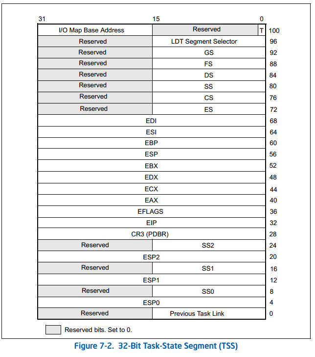

# 理论补充

## Bug Fix
Lab 3 牵扯到一个 Bug，通过`objdump -h obj/kern/kernel`查看 .bss 段的大小，再在 kern/init.c 中的`i386_init`打印一下`edata`和`end - edata`的值，可以发现其比真实的 .bss 段大小少了 0x14 字节，这是 kern/kernel.dl 中的一个 Bug，将 .bss 段修改如下即可：
```
.bss : {
  PROVIDE(edata = .);
  *(.dynbss)
      *(.bss .bss.*)
      *(COMMON)
      PROVIDE(end = .);
}
```

## TSS 与中断
TSS 是位于内存中的一个结构体，被称为任务状态段，其保存的内容如下：



保存了特权环 0~2 的 SS 寄存器与 ESP 寄存器值，当发生中断，执行保存断点操作时（由硬件自动完成）：
* 中断发生于用户态：从 TSS 中提取出 SS0 和 ESP0，恢复到 SS 寄存器和 ESP 寄存器中，并将当前的 SS、ESP、EFLAGS、CS、EIP 压栈；
* 中断发生于用户态：将当前的 EFLAGS、CS、EIP 压栈；

TR 段寄存器保存了 TSS 的段基址、大小以及一些属性位

## iret 指令
该指令将 CS 恢复后，如果发生了内核态到用户态的切换，则继续 pop 出 ESP、SS 的值并恢复到寄存器

## 页错误
当 CPU 发现一个页错误，会将导致页错误的虚拟地址保存在 CR2 寄存器

# 代码解析

## 进程描述符
inc/env.h 下的`Env`结构体相当于 Linux 下的`task_struct`，用于保存进程描述符，在 kern/env.c 中有如下全局变量：
```c
struct Env *envs = NULL;		      // 大小为 NENV 的 Env 数组，维护所有 Env
struct Env *curenv = NULL;		    // 当前运行进程的 Env
static struct Env *env_free_list;	// 未分配的 Env 链表
```
结构体定义如下：
```c
enum {
	ENV_FREE = 0,
	ENV_DYING,
	ENV_RUNNABLE,
	ENV_RUNNING,
	ENV_NOT_RUNNABLE
};

struct Env {
	struct Trapframe env_tf;	// 保存寄存器值
	struct Env *env_link;		  // env_free_list 的 next
	envid_t env_id;			      // 进程 ID
	envid_t env_parent_id;		// 父进程 ID
	enum EnvType env_type;		// 进程类型，只有 ENV_TYPE_USER
	unsigned env_status;		  // 进程状态，可以为上述 enum
	uint32_t env_runs;		    // 进程被调度的次数
	pde_t *env_pgdir;		      // 进程页目录
};
```
在 kern/pmap.c 的`mem_init`追加对`envs`的内存分配，并将其映射进页表：
```c
// 紧跟 pages 的内存分配后
envs = (struct Env *) boot_alloc (NENV * sizeof(struct Env)) ;
memset (envs, 0, NENV * sizeof(struct Env)) ;

// 紧跟 UPAGES 的映射之后
boot_map_region(kern_pgdir, UENVS, PTSIZE, PADDR(envs), PTE_U | PTE_P) ;
```
在 kern/init.c 的`i386_init`中追加了对 kern/env.c 中`env_init`的调用，用于初始化`env_free_list`：
```c
void
env_init(void)
{
	// LAB 3: Your code here.
	env_free_list = NULL ;
	// 保持 env_free_list 顺序与 envs 顺序一致
	for (int i = NENV - 1; i >= 0; i--)
	{
		envs[i].env_id = 0 ;
		envs[i].env_status = ENV_FREE ;
		envs[i].env_link = env_free_list ;
		env_free_list = envs + i ;
	}

	// 更新 GDT，以区分用户、内核权限
	env_init_percpu();
}
```

## 权限划分
为了区分用户与内核权限，在 kern/env.c 中重新定义了 GDT：
```c
struct Segdesc gdt[] =
{
	SEG_NULL,
	// 内核代码段，最后一个参数是 DPL
	[GD_KT >> 3] = SEG(STA_X | STA_R, 0x0, 0xffffffff, 0),
	// 内核数据段
	[GD_KD >> 3] = SEG(STA_W, 0x0, 0xffffffff, 0),
	// 用户代码段
	[GD_UT >> 3] = SEG(STA_X | STA_R, 0x0, 0xffffffff, 3),
	// 用户数据段
	[GD_UD >> 3] = SEG(STA_W, 0x0, 0xffffffff, 3),
	// TSS（稍后设置）
	[GD_TSS0 >> 3] = SEG_NULL
};

struct Pseudodesc gdt_pd = {
	sizeof(gdt) - 1, (unsigned long) gdt
};

void
env_init_percpu(void)
{
  // 设置 GDTR
	lgdt(&gdt_pd);
	// 内核不会用到 GS, FS，留给用户当数据段寄存器（|3 为设置 RPL）
	asm volatile("movw %%ax,%%gs" : : "a" (GD_UD|3));
	asm volatile("movw %%ax,%%fs" : : "a" (GD_UD|3));
	// 暂时将 ES, DS, SS, CS 给内核（在需要时给用户）
	asm volatile("movw %%ax,%%es" : : "a" (GD_KD));
	asm volatile("movw %%ax,%%ds" : : "a" (GD_KD));
	asm volatile("movw %%ax,%%ss" : : "a" (GD_KD));
	asm volatile("ljmp %0,$1f\n 1:\n" : : "i" (GD_KT));
	// 把 LDTR 置空，因为不使用 LDT
	lldt(0);
}
```

## 内存分配
kern/env.c 下的`region_alloc`为进程分配`len`字节的物理内存，并将其映射到进程虚拟地址`va`处：
```c
static void
region_alloc(struct Env *e, void *va, size_t len)
{
	// LAB 3: Your code here.
	if (e == NULL)
		panic ("Env is null in region_alloc!") ;
	
  // 以页为单位内存对齐
	void *va_beg = (void *) ROUNDDOWN((uint32_t)va, PGSIZE) ;
	void *va_end = (void *) ROUNDUP((uint32_t)va + len, PGSIZE) ;
	if (va_end > va_beg)
		panic ("out of memory!") ;
	
  // 分配物理内存，并映射到进程页表
	for (void *va_cur = va_beg; va_cur < va_end; va_cur += PGSIZE)
	{
		struct PageInfo *pg = page_alloc (ALLOC_ZERO) ;
		if (!pg)
			panic ("no more page to alloc!") ;
			
		if (page_insert(e->env_pgdir, pg, va_cur, PTE_P | PTE_U | PTE_W) == -E_NO_MEM)
			panic ("no more page to create page table entry!") ;
	}
}
```

## 进程创建

### 分配进程描述符
kern/env.c 中的`env_alloc`用于为进程分配一个进程描述符：
```c
int
env_alloc(struct Env **newenv_store, envid_t parent_id)
{
	int32_t generation;
	int r;
	struct Env *e;

  // 分配进程描述符
	if (!(e = env_free_list))
		return -E_NO_FREE_ENV;

	// 初始化进程页表
	if ((r = env_setup_vm(e)) < 0)
		return r;

	// 生成 env_id
	generation = (e->env_id + (1 << ENVGENSHIFT)) & ~(NENV - 1);
	if (generation <= 0)
		generation = 1 << ENVGENSHIFT;
	e->env_id = generation | (e - envs);

	// 设置进程各种属性
	e->env_parent_id = parent_id;
	e->env_type = ENV_TYPE_USER;
	e->env_status = ENV_RUNNABLE;
	e->env_runs = 0;

	memset(&e->env_tf, 0, sizeof(e->env_tf));

	// 设置各种寄存器
	e->env_tf.tf_ds = GD_UD | 3;
	e->env_tf.tf_es = GD_UD | 3;
	e->env_tf.tf_ss = GD_UD | 3;
	e->env_tf.tf_esp = USTACKTOP;
	e->env_tf.tf_cs = GD_UT | 3;

	// 从 env_free_list 取出当前 Env
	env_free_list = e->env_link;
	*newenv_store = e;

	cprintf("[%08x] new env %08x\n", curenv ? curenv->env_id : 0, e->env_id);
	return 0;
}
```
可见进程 ID 并不是`envs`的下标，通过 inc/env.h 中的`ENVX`可以将进程 ID 转换为在`envs`中的下标，进一步可通过 kern/env.c 下的`envid2env`将进程 ID 给定进程 ID 返回进程描述符，如果给定的是 0 则返回当前进程描述符，比起直接通过`ENVX`从`envs`得到进程描述符，该函数做了一些检查：
```c
int
envid2env(envid_t envid, struct Env **env_store, bool checkperm)
{
	struct Env *e;

  // 返回当前进程描述符
	if (envid == 0) {
		*env_store = curenv;
		return 0;
	}

	// 如果进程描述符未被分配，或输入的 envid 格式不正确
	e = &envs[ENVX(envid)];
	if (e->env_status == ENV_FREE || e->env_id != envid) {
		*env_store = 0;
		return -E_BAD_ENV;
	}

	// checkperm 为 1 的情况下，如果该进程不是当前进程或不是当前进程的子进程
	if (checkperm && e != curenv && e->env_parent_id != curenv->env_id) {
		*env_store = 0;
		return -E_BAD_ENV;
	}

	*env_store = e;
	return 0;
}
```

### 初始化进程页表
kern/env.c 中的`env_setup_vm`用于初始化进程页表，将`kern_pgdir`中 UTOP 以上的映射都拷贝进来：
```c
static int
env_setup_vm(struct Env *e)
{
	int i;
	struct PageInfo *p = NULL;

	// 为进程页目录分配 1 页
	if (!(p = page_alloc(ALLOC_ZERO)))
		return -E_NO_MEM;

	// LAB 3: Your code here.
	e->env_pgdir = page2kva(p) ;
	p->pp_ref++ ;
	memcpy (e->env_pgdir, kern_pgdir, PGSIZE) ; // UTOP 以下 kern_pgdir 本来就没映射

	// 将虚拟地址 UVPT 映射到 env_pgdir 所在物理地址
	e->env_pgdir[PDX(UVPT)] = PADDR(e->env_pgdir) | PTE_P | PTE_U;

	return 0;
}
```

### 装载程序
由于 JOS 当前没有文件系统，所以 obj/user 下的用户程序被直接链接到了内核的 ELF 中，随着内核被加载进内存，为了让其被进程执行，需要将其从内核段拷贝到进程用户段，该过程由 kern/env.c 中的`load_icode`完成：
```c
static void
load_icode(struct Env *e, uint8_t *binary) // binary 指向内核中的用户程序
{
  // 检查 ELF 头合法性
	// LAB 3: Your code here.
	struct Elf *header = (struct Elf *) binary ;
	if (header->e_magic != ELF_MAGIC)
		panic ("this is not a valid ELF!") ;
	
  // 切换至进程页表，以完成如下 memcpy
	lcr3(PADDR(e->env_pgdir)) ;
	
  // 将程序从内核段拷贝到用户段
	struct Proghdr *ph = (struct Proghdr *) ((uint8_t *)header + header->e_phoff) ;
	struct Proghdr *eph = ph + header->e_phnum ;
	for (; ph < eph; ph++)
		if (ph->p_type == ELF_PROG_LOAD)
		{
			region_alloc(e, (void *)ph->p_va, ph->p_memsz) ;
			memcpy ((void *)ph->p_va, (void *)header + ph->p_offset, ph->p_filesz) ;
		}
  
  // 将程序入口设置为进程 EIP
	e->env_tf.tf_eip = header->e_entry ;
	
  // 切换回内核页表
	lcr3 (PADDR(kern_pgdir)) ;
	
	// 为进程开辟栈空间
	// LAB 3: Your code here.
	region_alloc(e, (void *)(USTACKTOP - PGSIZE), PGSIZE) ;
}
```

### 创建进程
kern/env.c 中的`env_create`用于创建一个类型为`type`的进程，并装载`binary`处的程序：
```c
void
env_create(uint8_t *binary, enum EnvType type)
{
	// 分配进程描述符
	// LAB 3: Your code here.
	struct Env *e = NULL ;
	if (env_alloc(&e, 0) < 0)
		panic ("no more Env to alloc!") ;
	
  e->env_type = type ;
  
	// 装载程序
	load_icode (e, binary) ;	
}
```

## 进程执行
kern/env.c 下的`env_run`用于执行进程：
```c
void
env_pop_tf(struct Trapframe *tf)
{
	asm volatile(
    // 让 ESP 指向 tf
		"\tmovl %0,%%esp\n"
    // 弹出 tf 中所有 r32 并恢复到对应寄存器
		"\tpopal\n"
    // 弹出 tf 中 ES, DS 并恢复到对应寄存器
		"\tpopl %%es\n"
		"\tpopl %%ds\n"
    // 跳过 tf 中的 tf_trapno, tf_errcode
		"\taddl $0x8,%%esp\n"
    // 弹出 tf 中的 EIP, CS, EFLAGS, ESP, SS 并恢复到对应寄存器
		"\tiret\n"
		: : "g" (tf) : "memory");
	panic("iret failed");
}

void
env_run(struct Env *e)
{
	// LAB 3: Your code here.
  // 将当前运行进程切换下来
  if (curenv != NULL && curenv->env_status == ENV_RUNNING)
		curenv->env_status = ENV_RUNNABLE ;
	
  // 将该进程切换上去
	curenv = e ;
	curenv->env_status = ENV_RUNNING ;
	curenv->env_runs++ ;
	
  // 切换页表
	lcr3(PADDR(curenv->env_pgdir)) ;
  // 恢复进程的寄存器，执行流切换至该进程
	env_pop_tf(&curenv->env_tf) ;
}
```

## 进程销毁
kern/env.c 中的`env_free`用于释放进程描述符：
```c
void
env_free(struct Env *e)
{
	pte_t *pt;
	uint32_t pdeno, pteno;
	physaddr_t pa;

	// 如果销毁的是当前正在运行的进程，则将页表切回内核
	if (e == curenv)
		lcr3(PADDR(kern_pgdir));

	cprintf("[%08x] free env %08x\n", curenv ? curenv->env_id : 0, e->env_id);

	// 将分配给进程的物理内存使用计数递减（递减到 0 回收）
	static_assert(UTOP % PTSIZE == 0);
	for (pdeno = 0; pdeno < PDX(UTOP); pdeno++) {

		if (!(e->env_pgdir[pdeno] & PTE_P))
			continue;

		// 从页目录中找到页表
		pa = PTE_ADDR(e->env_pgdir[pdeno]);
		pt = (pte_t*) KADDR(pa);

		// 将页表用到的物理页使用计数递减（递减到 0 回收）
		for (pteno = 0; pteno <= PTX(~0); pteno++) {
			if (pt[pteno] & PTE_P)
				page_remove(e->env_pgdir, PGADDR(pdeno, pteno, 0));
		}

		// 页表自身所在物理页使用计数递减（递减到 0 回收）
		e->env_pgdir[pdeno] = 0;
		page_decref(pa2page(pa));
	}

	// 页目录自身所在物理页使用计数递减（递减到 0 回收）
	pa = PADDR(e->env_pgdir);
	e->env_pgdir = 0;
	page_decref(pa2page(pa));

	// 将 Env 接入 env_free_list
	e->env_status = ENV_FREE;
	e->env_link = env_free_list;
	env_free_list = e;
}
```
kern/env.c 中的`env_destroy`用于销毁进程：
```c
void
env_destroy(struct Env *e)
{
	env_free(e);

	cprintf("Destroyed the only environment - nothing more to do!\n");
	while (1)
		monitor(NULL);
}
```

## 中断处理程序
kern/trapentry.S 中的`TRAPHANDLER`和`TRAPHANDLER_NOEC`用于创建一个名为`name`的函数，作为`num`的中断处理程序，对于 CPU 会自动 push 中断错误码的中断用`TRAPHANDLER`，对于 CPU 不会自动 push 中断错误码的中断用`TRAPHANDLER_NOEC`，可以利用这些宏创建一系列中断处理程序：
```asm
#define TRAPHANDLER(name, num) \
	.globl name;                 \
	.type name, @function;       \
	.align 2;                    \
	name:			                   \ /* 函数开始于此 */
	pushl $(num);                \
	jmp _alltraps

#define TRAPHANDLER_NOEC(name, num)	\
	.globl name;							        \
	.type name, @function;						\
	.align 2;							            \
	name:								              \
	pushl $0;							            \  /* 0 来填充中断错误码 */
	pushl $(num);							        \
	jmp _alltraps
	
/*
 * Lab 3: Your code here for generating entry points for the different traps.
 */
TRAPHANDLER_NOEC(divide_handler, T_DIVIDE)
TRAPHANDLER_NOEC(debug_handler, T_DEBUG)
TRAPHANDLER_NOEC(nmi_handler, T_NMI)
TRAPHANDLER_NOEC(brktp_handler, T_BRKPT)
TRAPHANDLER_NOEC(oflow_handler, T_OFLOW)
TRAPHANDLER_NOEC(bound_handler, T_BOUND)
TRAPHANDLER_NOEC(illop_handler, T_ILLOP)
TRAPHANDLER_NOEC(device_handler, T_DEVICE)
TRAPHANDLER(dblflt_handler, T_DBLFLT)
TRAPHANDLER(tss_handler, T_TSS)
TRAPHANDLER(segnp_handler, T_SEGNP)
TRAPHANDLER(stack_handler, T_STACK)
TRAPHANDLER(gpflt_handler, T_GPFLT)
TRAPHANDLER(pgflt_handler, T_PGFLT)
TRAPHANDLER_NOEC(fperr_handler, T_FPERR)
TRAPHANDLER(align_handler, T_ALIGN)
TRAPHANDLER_NOEC(mchk_handler, T_MCHK)
TRAPHANDLER_NOEC(simderr_handler, T_SIMDERR)
TRAPHANDLER_NOEC(syscall_handler, T_SYSCALL)
TRAPHANDLER_NOEC(default_handler, T_DEFAULT)

/*
 * Lab 3: Your code here for _alltraps
 */
.global _alltraps
_alltraps:
	pushl %ds
	pushl %es
	pushal    # 至此，栈中的数据刚好构成一个 Trapframe
	movw $GD_KD, %ax
	movw %ax, %ds
	movw %ax, %es
	push %esp # 将 Trapframe 起始地址作为 trap 的参数
	call trap
```
`trap`函数位于 kern/trap.c 中：
```c
void
trap(struct Trapframe *tf)
{
	asm volatile("cld" ::: "cc");

	// 确保中断已被关
	assert(!(read_eflags() & FL_IF));

	cprintf("Incoming TRAP frame at %p\n", tf);

  // 中断发生于用户态
	if ((tf->tf_cs & 3) == 3) {
		assert(curenv);

		// 将保存的现场拷贝到进程描述符，下一次运行进程时，将从中断处继续运行
		curenv->env_tf = *tf;
		tf = &curenv->env_tf;
	}

	// 维护全局变量 last_tf，以供今后 debug
	last_tf = tf;

	// 处理中断
	trap_dispatch(tf);

	// 恢复进程运行（这样的写法意味着无法处理嵌套中断）
	assert(curenv && curenv->env_status == ENV_RUNNING);
	env_run(curenv);
}
```
`trap_dispatch`位于 kern/trap.c：

```c
static void
trap_dispatch(struct Trapframe *tf)
{
	// LAB 3: Your code here.
  switch (tf->tf_trapno)
	{
	case T_PGFLT:   // 页错误
		page_fault_handler(tf) ;
		return ;
	case T_BRKPT:   // 断点
  case T_DEBUG:   // 单步
		monitor (tf) ;
		return ;
  case T_SYSCALL: // 系统调用
		tf->tf_regs.reg_eax = syscall (
			tf->tf_regs.reg_eax, tf->tf_regs.reg_edx,
			tf->tf_regs.reg_ecx, tf->tf_regs.reg_ebx,
			tf->tf_regs.reg_edi, tf->tf_regs.reg_esi) ;
    return ;
	}

	// 无法处理的中断，打印调试信息
	print_trapframe(tf);
  // 中断发生于内核，系统终止
	if (tf->tf_cs == GD_KT)
		panic("unhandled trap in kernel");
	else {
    // 中断发生于用户，仅销毁进程
		env_destroy(curenv);
		return;
	}
}
```

## 中断向量表
中断向量表定义于 kern/trap.c，`trap_init`负责对其初始化，在 kern/init.c 的`i386_init`中追加了对其的调用：
```c
struct Gatedesc idt[256] = { { 0 } };
struct Pseudodesc idt_pd = {
	sizeof(idt) - 1, (uint32_t) idt
};

void
trap_init(void)
{
	extern struct Segdesc gdt[];

	// LAB 3: Your code here.
	void divide_handler () ;
	// 参数 2：中断类型，trap 为 1，其他为 0
	// 参数 3：中断处理程序代码段
	// 参数 4：中断处理程序代码段偏移
	// 参数 5：中断处理程序 DPL
	SETGATE(idt[T_DIVIDE], 0, GD_KT, divide_handler, 0);
	void debug_handler();
	SETGATE(idt[T_DEBUG], 0, GD_KT, debug_handler, 3);
	void nmi_handler();
	SETGATE(idt[T_NMI], 0, GD_KT, nmi_handler, 0);
	void brktp_handler();
	SETGATE(idt[T_BRKPT], 1, GD_KT, brktp_handler, 3);
	void oflow_handler();
	SETGATE(idt[T_OFLOW], 0, GD_KT, oflow_handler, 0);
	void bound_handler();
	SETGATE(idt[T_BOUND], 0, GD_KT, bound_handler, 0);
	void illop_handler();
	SETGATE(idt[T_ILLOP], 0, GD_KT, illop_handler, 0);
	void device_handler();
	SETGATE(idt[T_DEVICE], 0, GD_KT, device_handler, 0);
	void dblflt_handler();
	SETGATE(idt[T_DBLFLT], 0, GD_KT, dblflt_handler, 0);
	void tss_handler();
	SETGATE(idt[T_TSS], 0, GD_KT, tss_handler, 0);
	void segnp_handler();
	SETGATE(idt[T_SEGNP], 0, GD_KT, segnp_handler, 0);
	void stack_handler();
	SETGATE(idt[T_STACK], 0, GD_KT, stack_handler, 0);
	void gpflt_handler();
	SETGATE(idt[T_GPFLT], 0, GD_KT, gpflt_handler, 0);
	void pgflt_handler();
	SETGATE(idt[T_PGFLT], 0, GD_KT, pgflt_handler, 0);
	void fperr_handler();
	SETGATE(idt[T_FPERR], 0, GD_KT, fperr_handler, 0);
	void align_handler();
	SETGATE(idt[T_ALIGN], 0, GD_KT, align_handler, 0);
	void mchk_handler();
	SETGATE(idt[T_MCHK], 0, GD_KT, mchk_handler, 0);
	void simderr_handler();
	SETGATE(idt[T_SIMDERR], 0, GD_KT, simderr_handler, 0);
	void syscall_handler();
	SETGATE(idt[T_SYSCALL], 1, GD_KT, syscall_handler, 3);
	void default_handler();
	SETGATE(idt[T_DEFAULT], 0, GD_KT, default_handler, 0);

	// 初始化 IDTR 和 TSS
	trap_init_percpu();
}

static struct Taskstate ts;

void
trap_init_percpu(void)
{
	// 初始化 TSS
	ts.ts_esp0 = KSTACKTOP;
	ts.ts_ss0 = GD_KD;
	ts.ts_iomb = sizeof(struct Taskstate);

	// 在 GDT 中设置 TSS
	gdt[GD_TSS0 >> 3] = SEG16(STS_T32A, (uint32_t) (&ts),
					sizeof(struct Taskstate) - 1, 0);
	gdt[GD_TSS0 >> 3].sd_s = 0;

	// 初始化 TR
	ltr(GD_TSS0);

	// 初始化 IDTR
	lidt(&idt_pd);
}
```

## 断点与单步
kern/monitor.c 中加入两个函数（同时也在 kern/monitor.h 中加入声明），一个用于处理单步，一个用于允许程序继续运行，并为`commands`新增两个命令来调用这两个函数：
```c
static struct Command commands[] = {
	// ...
	{ "c", "Break Continue:", mon_brkc },
	{ "s", "Break Step:", mon_brks },
};

// 单步
int
mon_brks(int argc, char **argv, struct Trapframe *tf)
{
	if (tf != NULL)
	{
		tf->tf_eflags |= FL_TF; // 将 TF 设为 1
		return -1 ; // 返回 -1，离开 monitor，接着执行用户代码
	}
	return 0;
}

// 程序继续运行
int
mon_brkc(int argc, char **argv, struct Trapframe *tf)
{
	if (tf != NULL)
	{
		tf->tf_eflags &= ~FL_TF; // 将 TF 位设为 0
		return -1 ;
	}
	return 0;
}
```

## 系统调用
kern 和 lib 中有许多同名文件，这些同名文件里又有同名函数，对于这些同名函数，内核会和 kern 中的链接，用户程序会和 lib 中的链接。如 lib/printf.c 如下，其大体与 kern/printf.c 相似，但做了一些修改，不是在`putch`中直接向屏幕输出，而是将其保存到一个`printbuf`中，最后调用`sys_cputs`：
```c
struct printbuf {
	int idx;	// buf 当前位置
	int cnt;	// 最终输出的字符数量
	char buf[256];
};


static void
putch(int ch, struct printbuf *b)
{
  // 保存要输出的字符
	b->buf[b->idx++] = ch;
  // buf 满了，则先将当前内容 sys_cputs
	if (b->idx == 256-1) {
		sys_cputs(b->buf, b->idx);
		b->idx = 0;
	}
	b->cnt++;
}

int
vcprintf(const char *fmt, va_list ap)
{
	struct printbuf b;

	b.idx = 0;
	b.cnt = 0;
  // 将要输出到内容保存到 b.buf
	vprintfmt((void*)putch, &b, fmt, ap);
	sys_cputs(b.buf, b.idx);

	return b.cnt;
}

int
cprintf(const char *fmt, ...)
{
	va_list ap;
	int cnt;

	va_start(ap, fmt);
	cnt = vcprintf(fmt, ap);
	va_end(ap);

	return cnt;
}
```
`sys_cputs`实现于 lib/syscall.c 中，用于触发一个系统调用：

```c
static inline int32_t
syscall(int num, int check, uint32_t a1, uint32_t a2, uint32_t a3, uint32_t a4, uint32_t a5)
{
	int32_t ret;

	asm volatile("int %1\n"   // 触发一个中断
		     : "=a" (ret)       // 系统调用返回值
		     : "i" (T_SYSCALL), // 中断号为 T_SYSCALL
		       "a" (num),       // 将系统调用号保存在 AX 寄存器
		       "d" (a1),        // 剩下寄存器保存系统调用参数
		       "c" (a2),
		       "b" (a3),
		       "D" (a4),
		       "S" (a5)
		     : "cc", "memory");

  // 如果系统调用不返回 0，表示出错
	if(check && ret > 0)
		panic("syscall %d returned %d (> 0)", num, ret);

	return ret;
}

void
sys_cputs(const char *s, size_t len)
{
	syscall(SYS_cputs, 0, (uint32_t)s, len, 0, 0, 0);
}
```
最后将由 kern/syscall.c 中的`syscall`来处理该系统调用：
```c
static void
sys_cputs(const char *s, size_t len)
{
	// LAB 3: Your code here.
  // 1. 检查用户是否有访问权限
  // 2. 检查页的完整性，以免以内核身份触发页错误导致系统终止
	user_mem_assert(curenv, s, len, PTE_U) ;

	// 调用的 kern/print.c 中的
	cprintf("%.*s", len, s);
}

int32_t
syscall(uint32_t syscallno, uint32_t a1, uint32_t a2, uint32_t a3, uint32_t a4, uint32_t a5)
{
	// LAB 3: Your code here.
	switch (syscallno) {
	case SYS_cputs:
		sys_cputs((char *)a1, a2) ;
		return 0 ;
	case SYS_cgetc:
		return sys_cgetc();
	case SYS_getenvid:
		return sys_getenvid();
	case SYS_env_destroy:
		return sys_env_destroy(a1);
	default:
		return -E_INVAL;
	}
}
```
`user_mem_assert`实现与 kern/pmap.c 中：

```c
int
user_mem_check(struct Env *env, const void *va, size_t len, int perm)
{
	// LAB 3: Your code here.
	void *va_beg = (void *) ROUNDDOWN((uint32_t)va, PGSIZE) ;
	void *va_end = (void *) ROUNDUP((uint32_t)va + len, PGSIZE) ;
  // 在页表中对范围内页做检查
	for (void *va_cur = va_beg; va_cur < va_end; va_cur += PGSIZE)
	{
		pte_t *pte = pgdir_walk(env->env_pgdir, va_cur, 0);
    // 无权访问
		if (!pte || !(*pte & PTE_P) || (*pte & perm) != perm)
		{
			user_mem_check_addr = (uintptr_t) (va_cur < va ? va : va_cur) ;
			return -E_FAULT ;
		}
	}

	return 0;
}

void
user_mem_assert(struct Env *env, const void *va, size_t len, int perm)
{
	if (user_mem_check(env, va, len, perm | PTE_U) < 0) {
		cprintf("[%08x] user_mem_check assertion failure for "
			"va %08x\n", env->env_id, user_mem_check_addr);
		env_destroy(env);	// 用户无权访问则直接销毁进程
	}
}
```

## 用户程序
用户程序的入口在 lib/entry.S，接着会跳到 lib/libmain.c：
```c
void
libmain(int argc, char **argv)
{
	// thisenv 指向 curenv
	// LAB 3: Your code here.
	thisenv = envs + ENVX(sys_getenvid());

	// 保存程序名，以便 panic 的时候利用
	if (argc > 0)
		binaryname = argv[0];

	// 调用 user/hello.c 中的 umain
	umain(argc, argv);

	exit();
}
```

## 页错误
页错误由 kern/trap.c 中的`page_fault_handler`处理：
```c
void
page_fault_handler(struct Trapframe *tf)
{
	uint32_t fault_va;

	// 从 CR2 中取得引发页错误的虚拟地址
	fault_va = rcr2();

	// 页错误由内核引发，系统终止
	// LAB 3: Your code here.
	if (!(tf->tf_cs & 3))
		panic ("kernel falut va %08x ip %08x\n", fault_va, tf->tf_eip) ;

	// 页错误由用户引发，终止进程
	cprintf("[%08x] user fault va %08x ip %08x\n",
		curenv->env_id, fault_va, tf->tf_eip);
	print_trapframe(tf);
	env_destroy(curenv);
}
```

## Debug
在 user/user.ld 中，将 stab_info 固定载入到了 0x200000：
```
.stab_info 0x200000 : {
		LONG(__STAB_BEGIN__);
		LONG(__STAB_END__);
		LONG(__STABSTR_BEGIN__);
		LONG(__STABSTR_END__);
	}
```
Lab 3 中 kern/kdebug.c 中的`debuginfo_eip`做了如下修改：
```c
if (addr >= ULIM) {
		// addr 在内核地址空间
		// ...
	} else {
		// addr 在用户地址空间
		// 从 USTABDATA(0x200000) 处读取 stab_info
		const struct UserStabData *usd = (const struct UserStabData *) USTABDATA;

		// 检查 stab_info 所在页的完整性和访问权限
		// LAB 3: Your code here.
		if (user_mem_check(curenv, usd, sizeof(struct UserStabData), PTE_U) < 0)
			return -1 ;

  	// 从 stab_info 中得到 stab, stabstr 的位置
		stabs = usd->stabs;
		stab_end = usd->stab_end;
		stabstr = usd->stabstr;
		stabstr_end = usd->stabstr_end;

  	// 检查 stab, stabstr 所在页的完整性和访问权限
		// LAB 3: Your code here.
		if (user_mem_check(curenv, stabs, stab_end - stabs, PTE_U) < 0)
			return -1;
		if (user_mem_check(curenv, stabstr, stabstr_end - stabstr, PTE_U) < 0)
			return -1;
	}
```

# Questions

## Question 1
> What is the purpose of having an individual handler function for each exception/interrupt? (i.e., if all exceptions/interrupts were delivered to the same handler, what feature that exists in the current implementation could not be provided?)

目前，中断处理程序都拥有各自的入口，再由 kern/trap.c 中的`trap`函数统一处理，再通过`trap_dispatch`交由不同的处理流程处理。为什么不直接让中断程序在一开始就统一入口？这是因为有的中断处理程序硬件会自动压入中断错误码，有的不会，会导致栈的分布不一样，从而难以由一个函数来统一处理

## Question 2
> Did you have to do anything to make the user/softint program behave correctly? The grade script expects it to produce a general protection fault (trap 13), but softint's code says int $14. Why should this produce interrupt vector 13? What happens if the kernel actually allows softint's int $14 instruction to invoke the kernel's page fault handler (which is interrupt vector 14)?

虽然 user/softing.c 中调用了如下指令来尝试触发 14 号中断：
```c
asm volatile ("int $14");
```
但实际上 14 号中断在 kern/trap.c 的`trap_init`中通过`SETGATE`设置为了只能在内核模式下产生（DPL），所以用户因为无权执行这条指令会触发一般保护错误（Trap 13）

## Question 3
> The break point test case will either generate a break point exception or a general protection fault depending on how you initialized the break point entry in the IDT (i.e., your call to SETGATE from trap_init). Why? How do you need to set it up in order to get the breakpoint exception to work as specified above and what incorrect setup would cause it to trigger a general protection fault?

只有在 kern/trap.c 的`trap_init`中通过`SETGATE`将断点中断的 DPL 设为 3，用户程序下的断点才能正常工作，否则就会像 [Question 2](#Question 2) 一样触发一般保护错误（Trap 13）

## Question 4
> What do you think is the point of these mechanisms, particularly in light of what the user/softint test program does?

为了不给用户太大的权限去引发一些特殊中断从而让整个系统崩溃