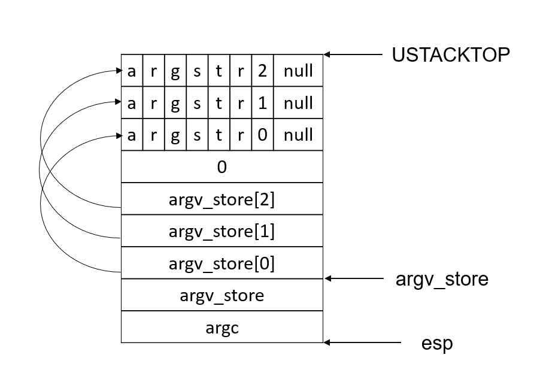

# 目录
[toc]

# 文件系统设计

* JOS 作为一个微内核操作系统，将文件系统实现在了用户空间，即有一个用户进程专门提供文件系统服务，其他进程通过 IPC 与其通信，具体如下；
* 因为文件系统服务由用户进程提供，用户进程独享一张页表，所以可以将大块虚拟内存映射到磁盘，之后的所有操作都直接针对内存进行，这也导致没有被映射到的磁盘区域将无法访问；
* JOS 不支持硬连接，所以无需设计 inode table，而是直接将文件元数据存储在目录文件中；
* JOS 中文件偏移是保存在文件描述符中的，并且文件描述符和打开文件表互相引用；
```
      Regular env           FS env
   +---------------+   +---------------+
   |      read     |   |   file_read   |
   |   (lib/fd.c)  |   |   (fs/fs.c)   |
...|.......|.......|...|.......^.......|...............
   |       v       |   |       |       | RPC mechanism
   |  devfile_read |   |  serve_read   |
   |  (lib/file.c) |   |  (fs/serv.c)  |
   |       |       |   |       ^       |
   |       v       |   |       |       |
   |     fsipc     |   |     serve     |
   |  (lib/file.c) |   |  (fs/serv.c)  |
   |       |       |   |       ^       |
   |       v       |   |       |       |
   |   ipc_send    |   |   ipc_recv    |
   |       |       |   |       ^       |
   +-------|-------+   +-------|-------+
           |                   |
           +-------------------+
```

# 代码解析

## 数据结构

### 文件元数据
inc/fs.h 中的`struct File`相当于 inode，用于保存文件的元数据：
```c
struct File {
	char f_name[MAXNAMELEN];    // 文件名
	off_t f_size;               // 文件大小   
	uint32_t f_type;		        // 文件类型
	uint32_t f_direct[NDIRECT];	// 直接引用（块号），0 表示未分配
	uint32_t f_indirect;		    // 存储间接引用的块（块号）
	uint8_t f_pad[256 - MAXNAMELEN - 8 - 4*NDIRECT - 4];
} __attribute__((packed));
```

### 文件描述符
inc/fd.h 中定义了文件描述符，描述符表被存放于`FDTABLE`处，一页一个（方便实现描述符拷贝以及通过 IPC 共享），并且在`FILEDATA`处为每个文件描述符分配了一个额外页（可选）：
```c
struct FdFile {
	int id;
};

struct Fd {
	int fd_dev_id;    // 设备类型
	off_t fd_offset;  // 读写偏移
	int fd_omode;     // 打开文件时的权限
	union {
		struct FdFile fd_file; // 打开文件表句柄
	};
};
```
lib/fd.c 中定义了描述符与描述符句柄（在描述符表中的下标）互相转化的方法：
```c
#define INDEX2FD(i)	((struct Fd*) (FDTABLE + (i)*PGSIZE))

int
fd2num(struct Fd *fd)
{
	return ((uintptr_t) fd - FDTABLE) / PGSIZE;
}
```
lib/fd.c 中的`fd2data`用于查找给定描述符对应额外页的虚拟地址：
```c
#define INDEX2DATA(i)	((char*) (FILEDATA + (i)*PGSIZE))

char*
fd2data(struct Fd *fd)
{
	return INDEX2DATA(fd2num(fd));
}
```

### 打开文件表
打开文件表定义于 fs/serv.c：
```c
struct OpenFile { // 表项
	uint32_t o_fileid;    // 打开文件表句柄（定位在表中的位置）
	struct File *o_file;	// 文件元数据
	int o_mode;		        // 打开时给的权限
	struct Fd *o_fd;	    // 文件描述符
};

struct OpenFile opentab[MAXOPEN] = {
	{ 0, 0, 1, 0 }
};
```
fs/serv.c 中的`serv_init`负责对其初始化：
```c
void
serve_init(void)
{
	int i;
	uintptr_t va = FILEVA; // 描述符表起始地址
	for (i = 0; i < MAXOPEN; i++) {
		opentab[i].o_fileid = i;
		opentab[i].o_fd = (struct Fd*) va; // 暂未分配物理页
		va += PGSIZE;
	}
}
```

#### 分配表项
fs/serv.c 下的`openfile_alloc`负责分配打开文件表表项：
```c
int
openfile_alloc(struct OpenFile **o)
{
	int i, r;

	// 查找第一个可供分配的打开文件表项
	for (i = 0; i < MAXOPEN; i++) {
		switch (pageref(opentab[i].o_fd)) { // 文件描述符对应物理页的引用计数
		case 0: // 该表项从未使用过，为其分配文件描述符空间
			if ((r = sys_page_alloc(0, opentab[i].o_fd, PTE_P|PTE_U|PTE_W)) < 0)
				return r;
		case 1: // 该表项曾经使用过（case 0 结束也会走到这）
			opentab[i].o_fileid += MAXOPEN; // 将其分配出去（for 扫不到，不会二次分配）
			*o = &opentab[i];
			memset(opentab[i].o_fd, 0, PGSIZE);
			return (*o)->o_fileid; // 返回打开文件表句柄
		}
	}
	return -E_MAX_OPEN;
}
```

#### 查找表项
fs/serv.c 下的`openfile_lookup`根据打开文件表句柄查找表项（必须是已经使用的，即对应的文件描述符已经共享映射给了用户）：
```c
int // envid 没用上 ???
openfile_lookup(envid_t envid, uint32_t fileid, struct OpenFile **po)
{
	struct OpenFile *o;

	// 查找表项
	o = &opentab[fileid % MAXOPEN];
	// 对应文件描述符没有映射给用户 或 打开文件表句柄提供的不正确
	if (pageref(o->o_fd) <= 1 || o->o_fileid != fileid)
		return -E_INVAL;
	*po = o;
	return 0;
}
```

## 磁盘映射

### 设置映射
由 fs/fs.c 中的`fs_init`完成内存到磁盘的映射：
```c
void
fs_init(void)
{
	static_assert(sizeof(struct File) == 256);

	// 如果 1 号磁盘可用，选用 1 号磁盘
	if (ide_probe_disk1())
		ide_set_disk(1);
	else // 否则选用 0 号磁盘
		ide_set_disk(0);
	// 磁盘映射
	bc_init();

	// 让 super 指向 super block 所在内存
	super = diskaddr(1);
	check_super();

	// 让 bitmap 指向所在内存
	bitmap = diskaddr(2);
	check_bitmap();
}
```
`bc_init`定义于 fs/bc.c：
```c
void
bc_init(void)
{
	struct Super super;
	// 设置页错误处理程序
	set_pgfault_handler(bc_pgfault);
	check_bc(); // For Lab 5

	// 通过一次读取，将 super block 提前缓存到内存
	memmove(&super, diskaddr(1), sizeof super);
}
```
所依赖的用户级页错误处理程序`bc_pgfault`定义于 fs/bc.c：
```c
static void
bc_pgfault(struct UTrapframe *utf)
{
	// 将虚拟地址转化为块号
	void *addr = (void *) utf->utf_fault_va;
	uint32_t blockno = ((uint32_t)addr - DISKMAP) / BLKSIZE;
	int r;

	// 检查是否在映射范围内
	if (addr < (void*)DISKMAP || addr >= (void*)(DISKMAP + DISKSIZE))
		panic("page fault in FS: eip %08x, va %08x, err %04x",
		      utf->utf_eip, addr, utf->utf_err);

	// 检查块号合法性
	if (super && blockno >= super->s_nblocks)
		panic("reading non-existent block %08x\n", blockno);

	// 分配物理内存，并从磁盘将内容读到内存
	// LAB 5: you code here:
	addr = (void *)ROUNDDOWN((uint32_t)addr, PGSIZE);
	if ((r = sys_page_alloc(0, addr, PTE_P | PTE_U | PTE_W)) < 0)
		panic("alloc failed: %e", r);
	if ((r = ide_read(blockno * BLKSECTS, addr, BLKSECTS) < 0))
		panic("ide read failed: %e", r);

	// 将物理内存映射到虚拟地址
	if ((r = sys_page_map(0, addr, 0, addr, uvpt[PGNUM(addr)] & PTE_SYSCALL)) < 0)
		panic("in bc_pgfault, sys_page_map: %e", r);

	// 看所读块是否未分配
	// 最后进行，因为当前读取的块可能就是 bitmap 自身
	if (bitmap && block_is_free(blockno))
		panic("reading free block %08x\n", blockno);
}
```
fs/bc.c 下的`diskaddr`将给定页号转化为对应的虚拟内存地址：
```c
void*
diskaddr(uint32_t blockno)
{
	// 不能访问 MBR
	if (blockno == 0 || (super && blockno >= super->s_nblocks))
		panic("bad block number %08x in diskaddr", blockno);
	return (char*) (DISKMAP + blockno * BLKSIZE);
}
```

### 刷脏页
fs/bc.c 下的`va_is_dirty`检查给定页面是否为脏页，当对页面进行写入时，将由底层硬件自动为页面打上`PTE_D`标记：
```c
bool
va_is_dirty(void *va)
{
	return (uvpt[PGNUM(va)] & PTE_D) != 0;
}
```
fs/bc.c 下的`flush_block`用于将脏页刷盘：
```c
void
flush_block(void *addr)
{
	// 根据虚拟地址计算块号
	uint32_t blockno = ((uint32_t)addr - DISKMAP) / BLKSIZE;
	
	// 块号不合法
	if (addr < (void*)DISKMAP || addr >= (void*)(DISKMAP + DISKSIZE))
		panic("flush_block of bad va %08x", addr);

	// LAB 5: Your code here.
	addr = (void *) ROUNDDOWN(addr, BLKSIZE) ;
	if (!va_is_mapped(addr)) // 地址未映射
		return ;
	if (!va_is_dirty(addr))  // 不是脏页
		return ;
	
	int r ;
	// 将数据写入磁盘
	if ((r = ide_write(blockno * BLKSECTS, addr, BLKSECTS)) < 0)
		panic ("ide write failed: %e", r) ;
	// 取消页面的 PTE_D 标记
	if ((r = sys_page_map(0, addr, 0, addr, uvpt[PGNUM(addr)] & PTE_SYSCALL)) < 0)
		panic ("page map failed: %e", r) ;
}
```

## 磁盘块管理

### 检查块分配情况
fs/fs.c 中的`block_is_free`通过 bitmap 检查磁盘块的分配情况：
```c
bool
block_is_free(uint32_t blockno)
{
	// 块号不合法
	if (super == 0 || blockno >= super->s_nblocks)
		return 0;
	// bitmap 中标记为 1 表示未分配
	if (bitmap[blockno / 32] & (1 << (blockno % 32)))
		return 1;
	// 否则已分配
	return 0;
}
```

### 分配块
fs/fs.c 中的`alloc_block`负责磁盘块的分配：
```c
int
alloc_block(void)
{
	// LAB 5: Your code here.
	// 跳过头两块的 MBR 和 super block
	for (int blockno = 2; blockno < super->s_nblocks; blockno++)
	{
		// 找到首个未分配的块
		if (block_is_free(blockno))
		{
			// 更新内存中的 bitmap 并刷盘
			bitmap[blockno / 32] ^= (1 << (blockno % 32)) ;
			flush_block (bitmap) ;
			return blockno ;
		}
	}
	
	return -E_NO_DISK;
}
```

### 回收块
fs/fs.c 中的`free_block`负责磁盘块的回收：
```c
void
free_block(uint32_t blockno)
{
	// 不能回收 MBR
	if (blockno == 0)
		panic("attempt to free zero block");
	bitmap[blockno/32] |= 1<<(blockno%32);
}
```

## 文件操作

### 文件查找

#### 查找文件块
fs/fs.c 下的`file_block_walk`用于查找文件的第`filebno`块的块号：
```c
static int // 返回 ppdiskbno 指向的内容记录了块号
file_block_walk(struct File *f, uint32_t filebno, uint32_t **ppdiskbno, bool alloc)
{
	// LAB 5: Your code here.
	// 块偏移不合法
	if (filebno > NDIRECT + NINDIRECT)
		return -E_INVAL ;
	
	// 位于直接引用
	if (filebno < NDIRECT)
	{
		if (ppdiskbno)
			*ppdiskbno = f->f_direct + filebno ;
		return 0 ;
	}
	
	// 存储间接引用的块还未分配
	int r ;
	if (!f->f_indirect)
	{
		if (!alloc)
			return -E_NOT_FOUND ;
		
		// 分配块存储间接引用
		if ((r = alloc_block()) < 0)
			return r ;
		memset (diskaddr(r), 0, BLKSIZE) ;
    flush_block(diskaddr(r)) ;
		f->f_indirect = r ; // 需要刷盘，因为磁盘原数据无意义，以防断电后被读到
	}
	
	*ppdiskbno = (uint32_t *)diskaddr(f->f_indirect) + filebno - NDIRECT ;
	return 0 ;
}
```
fs/fs.c 下的`file_get_block`用于查找文件的第`filebno`块对应的虚拟内存地址，如果块不存在则创建：
```c
int
file_get_block(struct File *f, uint32_t filebno, char **blk)
{
	// LAB 5: Your code here.
	int r ;
	uint32_t *pdiskbno ;
	// 找到对应的块
	if ((r = file_block_walk(f, filebno, &pdiskbno, true)) < 0)
		return r;
	
	if (*pdiskbno == 0)
	{
		// 如果块不存在，分配
		if ((r = alloc_block()) < 0)
			return r;
		*pdiskbno = r;
		memset(diskaddr(r), 0, BLKSIZE);
    flush_block(diskaddr(r)) ; // 需要刷盘，因为磁盘原数据无意义，以防断电后被读到
	}
	
	*blk = diskaddr(*pdiskbno) ;
	return 0 ;
}
```

#### 目录下查找
fs/fs.c 下的`dir_lookup`在指定目录下查找文件：
```c
static int
dir_lookup(struct File *dir, const char *name, struct File **file) // 返回 file
{
	int r;
	uint32_t i, j, nblock;
	char *blk;
	struct File *f;

	// 目录文件必须是块大小的整数倍
	assert((dir->f_size % BLKSIZE) == 0);
	nblock = dir->f_size / BLKSIZE;
	for (i = 0; i < nblock; i++) {
		// 获取目录文件的每一块数据
		if ((r = file_get_block(dir, i, &blk)) < 0)
			return r;
		f = (struct File*) blk;
		for (j = 0; j < BLKFILES; j++)
      // 检索这个块的所有文件元数据，找到名字匹配的
			if (strcmp(f[j].f_name, name) == 0) {
				*file = &f[j];
				return 0;
			}
	}
	return -E_NOT_FOUND;
}
```

#### 基于路径查找
fs/fs.c 下的`walk_path`基于给定路径查找文件：
```c
static int // 返回的 pf, pdir 分别为文件及所在目录
walk_path(const char *path, struct File **pdir, struct File **pf, char *lastelem)
{
	const char *p;
	char name[MAXNAMELEN];
	struct File *dir, *f;
	int r;

	// skip_slash 用于跳过 '/'
	path = skip_slash(path);
	f = &super->s_root; // 从根开始查
	dir = 0;
	name[0] = 0;

	if (pdir)
		*pdir = 0;
	*pf = 0;
	while (*path != '\0') {
		dir = f; // 上级目录
		p = path;
		while (*path != '/' && *path != '\0') // 截取出两个 '/' 之间的
			path++;
		if (path - p >= MAXNAMELEN)
			return -E_BAD_PATH;
		memmove(name, p, path - p); // 保存在 name 中
		name[path - p] = '\0';
		path = skip_slash(path);

		if (dir->f_type != FTYPE_DIR)
			return -E_NOT_FOUND;

    // 在上级目录中查找 name 文件
		if ((r = dir_lookup(dir, name, &f)) < 0) {
			if (r == -E_NOT_FOUND && *path == '\0') {
        // 路径已到终点，但并未找到文件
				if (pdir)
					*pdir = dir; // 将上级目录保存
				if (lastelem)
					strcpy(lastelem, name); // 将文件名存到 lastelem
				*pf = 0;
			}
      // 路径的中间文件夹不存在或其他错误
			return r;
		}
	}
	
  // 保存结果
	if (pdir)
		*pdir = dir;
	*pf = f;
	return 0;
}
```

### 文件打开
fs/fs.c 下通过`file_open`打开给定路径文件：
```c
int
file_open(const char *path, struct File **pf)
{
	return walk_path(path, 0, pf, 0);
}
```

### 文件创建
fs/fs.c 下的`dir_alloc_file`用于在指定目录下为文件分配一个文件元数据：
```c
static int
dir_alloc_file(struct File *dir, struct File **file)
{
	int r;
	uint32_t nblock, i, j;
	char *blk;
	struct File *f;

	assert((dir->f_size % BLKSIZE) == 0);
	nblock = dir->f_size / BLKSIZE;
	for (i = 0; i < nblock; i++) {
		// 获取目录文件的每一块数据
		if ((r = file_get_block(dir, i, &blk)) < 0)
			return r;
		f = (struct File*) blk;
		for (j = 0; j < BLKFILES; j++)
			// 检索这个块的所有文件元数据，如果未使用则分配
			if (f[j].f_name[0] == '\0') {
				*file = &f[j];
				return 0;
			}
	}
	// 目录文件已满，为其再创建一个块
	dir->f_size += BLKSIZE;
	if ((r = file_get_block(dir, i, &blk)) < 0)
		return r;
	f = (struct File*) blk; // 分配块的首个文件元数据
	*file = &f[0];
	return 0;
}
```
fs/fs.c 中的`file_create`用于在指定路径创建文件：
```c
int
file_create(const char *path, struct File **pf)
{
	char name[MAXNAMELEN];
	int r;
	struct File *dir, *f;

	// 解析路径，确定文件所属目录及文件名
	if ((r = walk_path(path, &dir, &f, name)) == 0)
		return -E_FILE_EXISTS; // 文件已存在
	if (r != -E_NOT_FOUND || dir == 0)
		return r; // 路径的中间文件夹不存在或其他错误
	if ((r = dir_alloc_file(dir, &f)) < 0) // 分配文件元数据
		return r;

	strcpy(f->f_name, name); // 将文件名写入元数据
	*pf = f;
	file_flush(dir);
	return 0;
}
```

### 更改文件大小
fs/fs.c 下的`file_set_size`用于更改文件大小：
```c
int
file_set_size(struct File *f, off_t newsize)
{
	if (f->f_size > newsize)
		// 如果是缩小，则截断文件
		file_truncate_blocks(f, newsize);
	f->f_size = newsize;
	flush_block(f);
	return 0;
}
```
`file_truncate_blocks`定义于 fs/fs.c：

```c
static void
file_truncate_blocks(struct File *f, off_t newsize)
{
	int r;
	uint32_t bno, old_nblocks, new_nblocks;
	
	old_nblocks = (f->f_size + BLKSIZE - 1) / BLKSIZE;
	new_nblocks = (newsize + BLKSIZE - 1) / BLKSIZE;
	for (bno = new_nblocks; bno < old_nblocks; bno++)
    // 将多余的块释放
		if ((r = file_free_block(f, bno)) < 0)
			cprintf("warning: file_free_block: %e", r);
	
  // 如果剩余块已经用不到间接引用，则释放存储间接引用的块
	if (new_nblocks <= NDIRECT && f->f_indirect) {
		free_block(f->f_indirect);
		f->f_indirect = 0;
	}
}
```
`file_free_block`定义于 fs/fs.c：
```c
static int
file_free_block(struct File *f, uint32_t filebno)
{
	int r;
	uint32_t *ptr;
	
	// 将文件块偏移转为块号
	if ((r = file_block_walk(f, filebno, &ptr, 0)) < 0)
		return r;
	if (*ptr) {
    // 释放块，并在文件元信息中将此块标为 0
		free_block(*ptr);
		*ptr = 0;
	}
	return 0;
}
```

### 文件读
fs/fs.c 下的`file_read`用于从文件`offset`处读取`count`个字节到`buf`：
```c
ssize_t
file_read(struct File *f, void *buf, size_t count, off_t offset)
{
	int r, bn;
	off_t pos;
	char *blk;

	if (offset >= f->f_size)
		return 0;

	// 如果 offset 大过文件，只读到文件末尾
	count = MIN(count, f->f_size - offset);

	for (pos = offset; pos < offset + count; ) {
		// 读取 pos 所在的块
		if ((r = file_get_block(f, pos / BLKSIZE, &blk)) < 0)
			return r;
		// 从所在块的 pos % BLKSIZE 处往后读
		bn = MIN(BLKSIZE - pos % BLKSIZE, offset + count - pos);
		memmove(buf, blk + pos % BLKSIZE, bn);
		pos += bn;
		buf += bn;
	}

	return count;
}
```

### 文件写
fs/fs.c 下的`file_write`用于从`buf`写`count`个字节到文件`offset`处：
```c
int
file_write(struct File *f, const void *buf, size_t count, off_t offset)
{
	int r, bn;
	off_t pos;
	char *blk;

	// 如有必要，扩大文件大小
	if (offset + count > f->f_size)
		if ((r = file_set_size(f, offset + count)) < 0)
			return r;

	for (pos = offset; pos < offset + count; ) {
    // 读取 pos 所在的块
		if ((r = file_get_block(f, pos / BLKSIZE, &blk)) < 0)
			return r;
    // 从所在块的 pos % BLKSIZE 处往后写
		bn = MIN(BLKSIZE - pos % BLKSIZE, offset + count - pos);
		memmove(blk + pos % BLKSIZE, buf, bn);
		pos += bn;
		buf += bn;
	}

	return count;
}
```

### 文件同步
fs/fs.c 下的`file_flush`用于将指定文件刷盘：
```c
void
file_flush(struct File *f)
{
	int i;
	uint32_t *pdiskbno;

	for (i = 0; i < (f->f_size + BLKSIZE - 1) / BLKSIZE; i++) {
		// 查找文件的每一块
		if (file_block_walk(f, i, &pdiskbno, 0) < 0 ||
		    pdiskbno == NULL || *pdiskbno == 0)
			continue;
		// 执行刷盘
		flush_block(diskaddr(*pdiskbno));
	}
	// 将文件元数据也刷盘
	flush_block(f);
	if (f->f_indirect) // 将间接引用所在块也刷盘
		flush_block(diskaddr(f->f_indirect));
}
```

### 磁盘同步
fs/fs.c 下的`fs_sync`用于执行整个磁盘范围的刷盘：
```c
void
fs_sync(void)
{
	int i;
	for (i = 1; i < super->s_nblocks; i++)
		flush_block(diskaddr(i));
}
```

## 文件系统服务

### 服务启动
在 kern/init.c 的`i386_init`中创建了文件系统服务进程，在 kern/env.c 的`env_create`中为其开启 I/O 权限：
```c
void
env_create(uint8_t *binary, enum EnvType type)
{
	// ...
	// LAB 5: Your code here.
	if (type == ENV_TYPE_FS)
		e->env_tf.tf_eflags |= FL_IOPL_3 ;
}
```
fs/serv.c 的`umain`为文件系统服务的入口：
```c
void
umain(int argc, char **argv)
{
	static_assert(sizeof(struct File) == 256);
	// 保存程序名，以便 panic 的时候利用
	binaryname = "fs";
	cprintf("FS is running\n");

	// 检查是否具有 I/O 权限
	outw(0x8A00, 0x8A00);
	cprintf("FS can do I/O\n");
	
	// 初始化打开文件表
	serve_init();
	// 完成内存到磁盘的映射
	fs_init();
        fs_test(); // For Lab 5
  // 开始提供服务
	serve();
}
```
`serve`定义于 fs/serv.c：
```c
union Fsipc *fsreq = (union Fsipc *)0x0ffff000;

void
serve(void)
{
	uint32_t req, whom;
	int perm, r;
	void *pg;

	while (1) {
		perm = 0;
    // 开始接受其他进程的 IPC 请求（以共享内存形式）
		req = ipc_recv((int32_t *) &whom, fsreq, &perm);
		if (debug)
			cprintf("fs req %d from %08x [page %08x: %s]\n",
				req, whom, uvpt[PGNUM(fsreq)], fsreq);

		// 对方没有共享页
		if (!(perm & PTE_P)) {
			cprintf("Invalid request from %08x: no argument page\n",
				whom);
			continue;
		}

		pg = NULL;
		if (req == FSREQ_OPEN) {
      // 打开文件请求
			r = serve_open(whom, (struct Fsreq_open*)fsreq, &pg, &perm);
		} else if (req < ARRAY_SIZE(handlers) && handlers[req]) {
      // 其他请求
			r = handlers[req](whom, fsreq);
		} else {
      // 非法请求
			cprintf("Invalid request code %d from %08x\n", req, whom);
			r = -E_INVAL;
		}
    // 将请求结果送回
		ipc_send(whom, r, pg, perm);
		sys_page_unmap(0, fsreq); // 取消共享页的映射，已备下一个请求使用
	}
}
```

### 打开文件
fs/serv.c 中的`serve_open`用于提供打开文件服务：
```c
int
serve_open(envid_t envid, struct Fsreq_open *req,
	   void **pg_store, int *perm_store)
{
	char path[MAXPATHLEN];
	struct File *f;
	int fileid;
	int r;
	struct OpenFile *o;

	if (debug)
		cprintf("serve_open %08x %s 0x%x\n", envid, req->req_path, req->req_omode);

	// 将请求路径拷贝到 path 局部变量
	memmove(path, req->req_path, MAXPATHLEN);
	path[MAXPATHLEN-1] = 0;

	// 分配打开文件表项
	if ((r = openfile_alloc(&o)) < 0) {
		if (debug)
			cprintf("openfile_alloc failed: %e", r);
		return r;
	}
	fileid = r;

	// 如果需要创建文件
	if (req->req_omode & O_CREAT) {
		if ((r = file_create(path, &f)) < 0) {
			if (!(req->req_omode & O_EXCL) && r == -E_FILE_EXISTS)
				goto try_open; // 文件已存在，直接打开
			if (debug)
				cprintf("file_create failed: %e", r);
			return r;
		}
	} else {
try_open: // ??? 感觉多余
		if ((r = file_open(path, &f)) < 0) {
			if (debug)
				cprintf("file_open failed: %e", r);
			return r;
		}
	}

	// 如果以截断模式打开，则将文件截断为 0 大小
	if (req->req_omode & O_TRUNC) {
		if ((r = file_set_size(f, 0)) < 0) {
			if (debug)
				cprintf("file_set_size failed: %e", r);
			return r;
		}
	}
  // 打开文件
	if ((r = file_open(path, &f)) < 0) {
		if (debug)
			cprintf("file_open failed: %e", r);
		return r;
	}

	// 文件元数据关联到打开文件表
	o->o_file = f;

	// 设置文件描述符
	o->o_fd->fd_file.id = o->o_fileid;
	o->o_fd->fd_omode = req->req_omode & O_ACCMODE; // & O_ACCMODE 将高位截断
	o->o_fd->fd_dev_id = devfile.dev_id; // 创建的为磁盘设备文件
	o->o_mode = req->req_omode;

	if (debug)
		cprintf("sending success, page %08x\n", (uintptr_t) o->o_fd);

	// 记录文件描述符所在页，以供 IPC
	*pg_store = o->o_fd;
	*perm_store = PTE_P|PTE_U|PTE_W|PTE_SHARE;

	return 0;
}
```

### 读文件
fs/serv.c 中的`serve_read`用于提供读取文件服务：
```c
int
serve_read(envid_t envid, union Fsipc *ipc)
{
	struct Fsreq_read *req = &ipc->read;
	struct Fsret_read *ret = &ipc->readRet;

	if (debug)
		cprintf("serve_read %08x %08x %08x\n", envid, req->req_fileid, req->req_n);

	// Lab 5: Your code here:
  // 从打开文件表中查找表项
	struct OpenFile *o ;
	int r ;
	if ((r = openfile_lookup(envid, req->req_fileid, &o)) < 0)
		return r ;
	
  // 读文件
	if ((r = file_read(o->o_file, ret->ret_buf, req->req_n, o->o_fd->fd_offset)) < 0)
		return r ;
	
  // 修改文件读写偏移
	o->o_fd->fd_offset += r ;
	return r ;
}
```

### 写文件
fs/serv.c 中的`serve_write`用于提供写文件服务：
```c
int
serve_write(envid_t envid, struct Fsreq_write *req)
{
	if (debug)
		cprintf("serve_write %08x %08x %08x\n", envid, req->req_fileid, req->req_n);

	// LAB 5: Your code here.
	// 从打开文件表中查找表项
	struct OpenFile *o ;
	int r ;
	if ((r = openfile_lookup(envid, req->req_fileid, &o)) < 0)
		return r ;
	
	// 写文件
	if ((r = file_write(o->o_file, req->req_buf, req->req_n, o->o_fd->fd_offset)) < 0)
		return r ;
	
	// 修改文件读写偏移
	o->o_fd->fd_offset += r;
	return r ;
}
```

### 文件同步
fs/serv.c 中的`serve_flush`用于提供单个文件的刷盘服务：
```c
int
serve_flush(envid_t envid, struct Fsreq_flush *req)
{
	struct OpenFile *o;
	int r;

	if (debug)
		cprintf("serve_flush %08x %08x\n", envid, req->req_fileid);

	if ((r = openfile_lookup(envid, req->req_fileid, &o)) < 0)
		return r;
	file_flush(o->o_file);
	return 0;
}
```

### 磁盘同步
fs/serv.c 中的`serve_sync`用于提供磁盘同步服务：
```c
int
serve_sync(envid_t envid, union Fsipc *req)
{
	// 对整个磁盘刷盘
	fs_sync();
	return 0;
}
```

## 文件描述符接口

### 分配描述符
fs/fd.c 下的`fd_alloc`用于为用户分配文件描述符，只是分配虚拟内存，以接受文件系统服务 IPC 共享：
```c
int
fd_alloc(struct Fd **fd_store)
{
	int i;
	struct Fd *fd;
	
	for (i = 0; i < MAXFD; i++) {
		// 找到第一个未映射的描述符页
		fd = INDEX2FD(i); // 将描述符表下标转化为虚拟地址
		if ((uvpd[PDX(fd)] & PTE_P) == 0 || (uvpt[PGNUM(fd)] & PTE_P) == 0) {
			*fd_store = fd;
			return 0;
		}
	}
	*fd_store = 0;
	return -E_MAX_OPEN;
}
```

### 查找描述符
fs/fd.c 下的`fd_lookup`用于基于文件描述符句柄查找已被使用（已有映射）的文件描述符：
```c
int
fd_lookup(int fdnum, struct Fd **fd_store)
{
	struct Fd *fd;
	
	// 下标越界
	if (fdnum < 0 || fdnum >= MAXFD) {
		if (debug)
			cprintf("[%08x] bad fd %d\n", thisenv->env_id, fdnum);
		return -E_INVAL;
	}
	// 得到文件描述符，并检查是否被映射
	fd = INDEX2FD(fdnum);
	if (!(uvpd[PDX(fd)] & PTE_P) || !(uvpt[PGNUM(fd)] & PTE_P)) {
		if (debug)
			cprintf("[%08x] closed fd %d\n", thisenv->env_id, fdnum);
		return -E_INVAL;
	}
	*fd_store = fd;
	return 0;
}
```

### 关闭描述符
fs/fd.c 下的`fd_lookup`用于关闭文件描述符，即做一些关闭前处理，并解除映射：
```c
int
fd_close(struct Fd *fd, bool must_exist)
{
	struct Fd *fd2;
	struct Dev *dev;
	int r;
	// 检查是否被使用
	if ((r = fd_lookup(fd2num(fd), &fd2)) < 0
	    || fd != fd2)
		return (must_exist ? r : 0);
	// 对应设备存在关闭处理函数，则调用
	if ((r = dev_lookup(fd->fd_dev_id, &dev)) >= 0) {
		if (dev->dev_close)
			r = (*dev->dev_close)(fd);
		else
			r = 0;
	}
	// 解除映射
	(void) sys_page_unmap(0, fd);
	return r;
}
```

## 用户统一接口

### 设备抽象
JOS 支持对磁盘、管道等多种文件的处理，不同的设备类型有不同的操作方式，定义于 inc/fd.h 中的`struct Dev`对这些操作进行了抽象，从而可以为用户提供统一的操作接口，相当于 VFS：
```c
struct Dev {
	int dev_id;
	const char *dev_name;
	ssize_t (*dev_read)(struct Fd *fd, void *buf, size_t len);
	ssize_t (*dev_write)(struct Fd *fd, const void *buf, size_t len);
	int (*dev_close)(struct Fd *fd);
	int (*dev_stat)(struct Fd *fd, struct Stat *stat);
	int (*dev_trunc)(struct Fd *fd, off_t length);
};
```
lib/fd.c 中维护了设备表，包含了所有设备实例：
```c
static struct Dev *devtab[] =
{
	&devfile, // 磁盘
	&devpipe, // 管道
	&devcons, // 字符终端
	0
};
```
通过 lib/fd.c 下的`dev_lookup`可以基于`dev_id`在设备表中查找到对应设备：
```c
int
dev_lookup(int dev_id, struct Dev **dev)
{
	int i;
	for (i = 0; devtab[i]; i++)
		// 扫描表中的元素，找到 dev_id 匹配的
		if (devtab[i]->dev_id == dev_id) {
			*dev = devtab[i];
			return 0;
		}
	cprintf("[%08x] unknown device type %d\n", thisenv->env_id, dev_id);
	*dev = 0;
	return -E_INVAL;
}
```

### 读操作
lib/fd.c 中定义的`read`尝试从文件中读最多`n`个字节，但实际上读到的字节数可能少于`n`：
```c
ssize_t
read(int fdnum, void *buf, size_t n)
{
	int r;
	struct Dev *dev;
	struct Fd *fd;
	
	// 查找文件描述符及对应设备
	if ((r = fd_lookup(fdnum, &fd)) < 0
	    || (r = dev_lookup(fd->fd_dev_id, &dev)) < 0)
		return r;
  // 如果该文件是以 write only 形式打开
	if ((fd->fd_omode & O_ACCMODE) == O_WRONLY) {
		cprintf("[%08x] read %d -- bad mode\n", thisenv->env_id, fdnum);
		return -E_INVAL;
	}
  // 如果设备没有定义读操作
	if (!dev->dev_read)
		return -E_NOT_SUPP;
  // 调用设备读操作
	return (*dev->dev_read)(fd, buf, n);
}
```
lib/fd.c 下的`readn`从文件中不断读取，直到读完`n`个字节：
```c
ssize_t
readn(int fdnum, void *buf, size_t n)
{
	int m, tot;

	for (tot = 0; tot < n; tot += m) {
		// 不断调用 read
		m = read(fdnum, (char*)buf + tot, n - tot);
		if (m < 0) // 如果出错，终止
			return m;
		if (m == 0) // 如果没有更多数据可读，终止
			break;
	}
	return tot;
}
```

### 写操作
lib/fd.c 下的`write`向文件写入`n`个字节：
```c
ssize_t
write(int fdnum, const void *buf, size_t n)
{
	int r;
	struct Dev *dev;
	struct Fd *fd;

	// 查找文件描述符及对应设备
	if ((r = fd_lookup(fdnum, &fd)) < 0
	    || (r = dev_lookup(fd->fd_dev_id, &dev)) < 0)
		return r;
	// 如果该文件是以 read only 形式打开
	if ((fd->fd_omode & O_ACCMODE) == O_RDONLY) {
		cprintf("[%08x] write %d -- bad mode\n", thisenv->env_id, fdnum);
		return -E_INVAL;
	}
	if (debug)
		cprintf("write %d %p %d via dev %s\n",
			fdnum, buf, n, dev->dev_name);
	// 如果设备没有定义写操作
	if (!dev->dev_write)
		return -E_NOT_SUPP;
	// 调用设备写操作
	return (*dev->dev_write)(fd, buf, n);
}
```

### 关闭描述符
lib/fd.c 下的`close`用于关闭指定文件描述符：
```c
int
close(int fdnum)
{
	struct Fd *fd;
	int r;
	
  // 查找文件描述符
	if ((r = fd_lookup(fdnum, &fd)) < 0)
		return r;
	else
		return fd_close(fd, 1); // 关闭（所关闭的描述符必须已被使用）
}
```
lib/fd.c 下的`close_all`用于关闭当前用户的所有文件描述符：
```c
void
close_all(void)
{
	int i;
	for (i = 0; i < MAXFD; i++)
		close(i);
}
```

### 描述符拷贝
lib/fd.c 下的`dup`用于拷贝文件描述符，让不同的文件描述符句柄指向同一文件描述符，具体通过共享页实现：
```c
int
dup(int oldfdnum, int newfdnum) // oldfdnum 拷贝到 newfdnum
{
	int r;
	char *ova, *nva;
	pte_t pte;
	struct Fd *oldfd, *newfd;

	// 查找 oldfdnum 对应描述符
	if ((r = fd_lookup(oldfdnum, &oldfd)) < 0)
		return r;
	close(newfdnum); // 关闭 newfdnum 对应描述符

	newfd = INDEX2FD(newfdnum);
	ova = fd2data(oldfd); // oldfd 对应额外页
	nva = fd2data(newfd); // newfd 对应额外页
	
  // 共享映射额外页
	if ((uvpd[PDX(ova)] & PTE_P) && (uvpt[PGNUM(ova)] & PTE_P))
		if ((r = sys_page_map(0, ova, 0, nva, uvpt[PGNUM(ova)] & PTE_SYSCALL)) < 0)
			goto err;
  // 共享映射描述符页
	if ((r = sys_page_map(0, oldfd, 0, newfd, uvpt[PGNUM(oldfd)] & PTE_SYSCALL)) < 0)
		goto err;

	return newfdnum;

err: // 如果出现任何错误，则解除对 newfd 的共享映射
	sys_page_unmap(0, newfd);
	sys_page_unmap(0, nva);
	return r;
}
```

## 文件系统接口

### 设备定义
文件系统接口即磁盘设备接口，定义于 lib/file.c：
```c
struct Dev devfile =
{
	.dev_id =	'f',
	.dev_name =	"file",
	.dev_read =	devfile_read,
	.dev_close =	devfile_flush,
	.dev_stat =	devfile_stat,
	.dev_write =	devfile_write,
	.dev_trunc =	devfile_trunc
};
```

### IPC
lib/file.c 中的`fsipc`用于将用户对磁盘文件的操作转化为向文件系统服务发送的请求：
```c
static int // 请求类型为 type，将结果映射到 dstva 所在页
fsipc(unsigned type, void *dstva)
{
	// 寻找文件系统服务对应的进程，static 只找一次
	static envid_t fsenv;
	if (fsenv == 0)
		fsenv = ipc_find_env(ENV_TYPE_FS);

	static_assert(sizeof(fsipcbuf) == PGSIZE);

	if (debug)
		cprintf("[%08x] fsipc %d %08x\n", thisenv->env_id, type, *(uint32_t *)&fsipcbuf);

	// 发送请求
	ipc_send(fsenv, type, &fsipcbuf, PTE_P | PTE_W | PTE_U);
  // 接收请求的结果
	return ipc_recv(NULL, dstva, NULL);
}
```

### 打开文件
lib/file.c 下的`open`用于打开磁盘文件：
```c
int
open(const char *path, int mode)
{
	int r;
	struct Fd *fd;
	
  // 路径过长
	if (strlen(path) >= MAXPATHLEN)
		return -E_BAD_PATH;
	
  // 分配描述符
	if ((r = fd_alloc(&fd)) < 0)
		return r;

  // 填充请求
	strcpy(fsipcbuf.open.req_path, path);
	fsipcbuf.open.req_omode = mode;

  // 发送请求
	if ((r = fsipc(FSREQ_OPEN, fd)) < 0) {
		fd_close(fd, 0); // 关闭文件描述符
		return r;
	}

	return fd2num(fd);
}
```

### 读文件
lib/file.c 下的`devfile_read`用于读取磁盘文件：
```c
static ssize_t
devfile_read(struct Fd *fd, void *buf, size_t n)
{
	int r;
  // 填充请求
	fsipcbuf.read.req_fileid = fd->fd_file.id;
	fsipcbuf.read.req_n = n;
  // 发送请求
	if ((r = fsipc(FSREQ_READ, NULL)) < 0)
		return r;
	assert(r <= n);
	assert(r <= PGSIZE);
  // 将数据从共享内存到 buf
	memmove(buf, fsipcbuf.readRet.ret_buf, r);
	return r;
}
```

### 写文件
lib/file.c 下的`devfile_write`用于向磁盘文件写入数据：
```c
static ssize_t
devfile_write(struct Fd *fd, const void *buf, size_t n)
{
	// LAB 5: Your code here
	// 填充请求
	int r ;
	fsipcbuf.write.req_fileid = fd->fd_file.id ;
	fsipcbuf.write.req_n = n ;
	memmove (fsipcbuf.write.req_buf, buf, n) ;
	
	// 发送请求
	if ((r = fsipc(FSREQ_WRITE, NULL)) < 0)
		return r ;
	
	assert(r <= n);
	assert(r <= PGSIZE);
	
	return r ;
}
```

### 关闭描述符
lib/file.c 下的`devfile_flush`用于在关闭描述符前执行文件同步：
```c
static int
devfile_flush(struct Fd *fd)
{
	fsipcbuf.flush.req_fileid = fd->fd_file.id;
	return fsipc(FSREQ_FLUSH, NULL);
}
```

### 磁盘同步
lib/file.c 下的`sync`用于执行磁盘同步：
```c
int
sync(void)
{
	// 发送请求，让文件系统刷盘
	return fsipc(FSREQ_SYNC, NULL);
}
```

## 管道接口

### 设备定义
管道设备接口定义于 lib/pipe.c：
```c
struct Dev devpipe =
{
	.dev_id =	'p',
	.dev_name =	"pipe",
	.dev_read =	devpipe_read,
	.dev_write =	devpipe_write,
	.dev_close =	devpipe_close,
	.dev_stat =	devpipe_stat,
};
```

### 管道建立
管道建立由 lib/pipe.c 下的`pipe`完成：
```c
int
pipe(int pfd[2])
{
	int r;
	struct Fd *fd0, *fd1;
	void *va;

	// 分配文件读端描述符，并为其分配物理页
	if ((r = fd_alloc(&fd0)) < 0
	    || (r = sys_page_alloc(0, fd0, PTE_P|PTE_W|PTE_U|PTE_SHARE)) < 0)
		goto err;
	
  // 分配写端文件描述符，并为其分配物理页
	if ((r = fd_alloc(&fd1)) < 0
	    || (r = sys_page_alloc(0, fd1, PTE_P|PTE_W|PTE_U|PTE_SHARE)) < 0)
		goto err1;

	// 为读端描述符关联额外页
	va = fd2data(fd0);
	if ((r = sys_page_alloc(0, va, PTE_P|PTE_W|PTE_U|PTE_SHARE)) < 0)
		goto err2;
  // 将额外页共享映射给写端
	if ((r = sys_page_map(0, va, 0, fd2data(fd1), PTE_P|PTE_W|PTE_U|PTE_SHARE)) < 0)
		goto err3;

	// 将读端设置为 read only
	fd0->fd_dev_id = devpipe.dev_id;
	fd0->fd_omode = O_RDONLY;
	
  // 将写设置为 write only
	fd1->fd_dev_id = devpipe.dev_id;
	fd1->fd_omode = O_WRONLY;

	if (debug)
		cprintf("[%08x] pipecreate %08x\n", thisenv->env_id, uvpt[PGNUM(va)]);
	
  // 返回文件描述符句柄
	pfd[0] = fd2num(fd0);
	pfd[1] = fd2num(fd1);
	return 0;

    err3:
	sys_page_unmap(0, va);
    err2:
	sys_page_unmap(0, fd1);
    err1:
	sys_page_unmap(0, fd0);
    err:
	return r;
}
```

## spawn
JOS 中将`fork`子进程后不继承父进程的执行流而是执行新的程序称为`spawn`

### 初始化用户栈
lib/swapn.c 下的`init_stack`用于为子进程分配并初始化用户栈，因为初始化是由父进程进行，所以先在`UTEMP`中操作，最后再将子进程的栈映射过来，最后要得到的栈布局如下：



```c
static int
init_stack(envid_t child, const char **argv, uintptr_t *init_esp)
{
	size_t string_size;
	int argc, i, r;
	char *string_store;
	uintptr_t *argv_store;

	// 统计 argv 字符串所有字符长度
	string_size = 0;
	for (argc = 0; argv[argc] != 0; argc++)
		string_size += strlen(argv[argc]) + 1;

	// 在 [string_store, UTEP + PGSIZE) 处临时存储字符串
	string_store = (char*) UTEMP + PGSIZE - string_size;
	// 在 [argv_store, string_store) 处临时存储指向字符串的指针
	argv_store = (uintptr_t*) (ROUNDDOWN(string_store, 4) - 4 * (argc + 1));

	// 在 argv_store - 4 处临时存储指向 argv_store 的指针
  // 在 argv_store - 8 处临时存储 argc
  // 因为 argv_store 类型为 uintptr_t * 所以下面只需要 -2 即可
	if ((void*) (argv_store - 2) < (void*) UTEMP)
		return -E_NO_MEM;

	// 分配 [UTEMP, UTEMP + PGSIZE)
	if ((r = sys_page_alloc(0, (void*) UTEMP, PTE_P|PTE_U|PTE_W)) < 0)
		return r;

	for (i = 0; i < argc; i++) {
    // 令指向字符串的指针指向 [USTACKTOP - PGSIZE, USTACKTOP) 同偏移处
		argv_store[i] = UTEMP2USTACK(string_store);
    // 将字符串都拷贝到 [string_store, UTEP + PGSIZE)
		strcpy(string_store, argv[i]);
		string_store += strlen(argv[i]) + 1;
	}
	argv_store[argc] = 0;
	assert(string_store == (char*)UTEMP + PGSIZE);

  // 存储指向 argv_store 的指针和 argc
	argv_store[-1] = UTEMP2USTACK(argv_store);
	argv_store[-2] = argc;

  // 让 esp 指向 [USTACKTOP - PGSIZE, USTACKTOP) 同偏移处
	*init_esp = UTEMP2USTACK(&argv_store[-2]);

	// 将子进程 [USTACKTOP - PGSIZE, USTACKTOP) 映射到 [UTEMP, UTEMP + PGSIZE) 同物理页
	if ((r = sys_page_map(0, UTEMP, child, (void*) (USTACKTOP - PGSIZE), PTE_P | PTE_U | PTE_W)) < 0)
		goto error;
  // 解除对 [UTEMP, UTEMP + PGSIZE) 的映射
	if ((r = sys_page_unmap(0, UTEMP)) < 0)
		goto error;

	return 0;

error:
	sys_page_unmap(0, UTEMP);
	return r;
}
```

### 加载程序段
lib/spawn.c 下的`map_segment`用于将文件偏移`fileoffset`处`filesz`大小的程序段加载到子进程的`[va, va + memsz)`处：
```c
static int
map_segment(envid_t child, uintptr_t va, size_t memsz,
	int fd, size_t filesz, off_t fileoffset, int perm)
{
	int i, r;
	void *blk;
	
	// 内存对齐
	if ((i = PGOFF(va))) {
		va -= i;
		memsz += i;
		filesz += i;
		fileoffset -= i;
	}
	
	for (i = 0; i < memsz; i += PGSIZE) {
		if (i >= filesz) {
			// 段已加载完，填空页
			if ((r = sys_page_alloc(child, (void*) (va + i), perm)) < 0)
				return r;
		} else {
			// 在 UTEMP 处分配一页
			if ((r = sys_page_alloc(0, UTEMP, PTE_P|PTE_U|PTE_W)) < 0)
				return r;
     	// 文件指针偏移
			if ((r = seek(fd, fileoffset + i)) < 0)
				return r;
      // 从文件中读取一页到 UTEMP
			if ((r = readn(fd, UTEMP, MIN(PGSIZE, filesz-i))) < 0)
				return r;
      // 让子进程映射过来
			if ((r = sys_page_map(0, UTEMP, child, (void*) (va + i), perm)) < 0)
				panic("spawn: sys_page_map data: %e", r);
      // 解除对 UTMP 的映射
			sys_page_unmap(0, UTEMP);
		}
	}
	return 0;
}
```

### 设置 Trapframe
因为子进程不再继承父进程的执行流，所以要修改子进程的`Trapframe`，在 kern/syscall.c 中提供了系统调用：
```c
static int
sys_env_set_trapframe(envid_t envid, struct Trapframe *tf)
{
	// LAB 5: Your code here.
	struct Env *e ;
	if (envid2env(envid, &e, 1) < 0)
		return -E_BAD_ENV ;
	
  tf->tf_eflags &= ~FL_IOPL_MASK ; // For Lab 5 user/faultio.c
	e->env_tf = *tf ; // pass by value
	return 0 ;
}

int32_t
syscall(uint32_t syscallno, uint32_t a1, uint32_t a2, uint32_t a3, uint32_t a4, uint32_t a5)
{
	switch (syscallno) {
	// ...
	case SYS_env_set_trapframe:
		return sys_env_set_trapframe(a1, (void *)a2);
	// ...
	}
}
```

### spawn
lib/spawn.c 中实现了`spawn`：
```c
int
spawn(const char *prog, const char **argv)
{
	unsigned char elf_buf[512];
	struct Trapframe child_tf;
	envid_t child;

	int fd, i, r;
	struct Elf *elf;
	struct Proghdr *ph;
	int perm;

	// 打开 ELF 文件
	if ((r = open(prog, O_RDONLY)) < 0)
		return r;
	fd = r;

	// 读取 ELF 信息
	elf = (struct Elf*) elf_buf;
	if (readn(fd, elf_buf, sizeof(elf_buf)) != sizeof(elf_buf)
	    || elf->e_magic != ELF_MAGIC) {
		close(fd);
		cprintf("elf magic %08x want %08x\n", elf->e_magic, ELF_MAGIC);
		return -E_NOT_EXEC;
	}

	// easy fork 出一个子进程
	if ((r = sys_exofork()) < 0)
		return r;
	child = r;
	// 因为子进程不会继承执行流，所以无需做 r == 0 的判断

	// 拿到子进程 Trapframe（pass by value）
	child_tf = envs[ENVX(child)].env_tf;
	child_tf.tf_eip = elf->e_entry; // 修改 eip 为 ELF 入口
	
	// 为子进程分配且初始化用户栈，并设置 esp
	if ((r = init_stack(child, argv, &child_tf.tf_esp)) < 0)
		return r;

	// 读取程序段并映射给子进程
	ph = (struct Proghdr*) (elf_buf + elf->e_phoff);
	for (i = 0; i < elf->e_phnum; i++, ph++) {
		if (ph->p_type != ELF_PROG_LOAD)
			continue;
		perm = PTE_P | PTE_U;
		if (ph->p_flags & ELF_PROG_FLAG_WRITE)
			perm |= PTE_W;
		if ((r = map_segment(child, ph->p_va, ph->p_memsz,
				     fd, ph->p_filesz, ph->p_offset, perm)) < 0)
			goto error;
	}
	close(fd); // 关闭 ELF 文件
	fd = -1;

	// 共享描述符给子进程
	if ((r = copy_shared_pages(child)) < 0)
		panic("copy_shared_pages: %e", r);

	// For Lab 5 user/faultio.c（正常不应该有）
	child_tf.tf_eflags |= FL_IOPL_3;
	if ((r = sys_env_set_trapframe(child, &child_tf)) < 0)
		panic("sys_env_set_trapframe: %e", r);

	// 将子进程设为可运行
	if ((r = sys_env_set_status(child, ENV_RUNNABLE)) < 0)
		panic("sys_env_set_status: %e", r);

	return child;

error:
	sys_env_destroy(child);
	close(fd);
	return r;
}
```

## 等待进程
lib/wait.c 下的`wait`用于等待特定进程结束：
```c
void
wait(envid_t envid)
{
	const volatile struct Env *e;

	assert(envid != 0);
	e = &envs[ENVX(envid)];
	while (e->env_id == envid && e->env_status != ENV_FREE)
		sys_yield();
}
```

## 文件描述符继承
在`serve_open`中将以共享页返回给用户的文件描述符都设为了`PTE_SHARE`

### For fork
为了让子进程能继承父进程的文件描述符，需要修改 Lab 4 中 lib/fork.c 下`duppage`的实现，使其支持页面共享：
```c
static int
duppage(envid_t envid, unsigned pn)
{
  // ...
  // PTE_W 可能与 PTE_SHARE 配合，所以要修改条件判断
	if ((pte & PTE_COW) || ((pte & PTE_W) && !(pte & PTE_SHARE)))
	{
		// ...
	}
	else if (pte & PTE_SHARE) // 共享页
	{
		if ((r = sys_page_map(0, va, envid, va, pte & PTE_SYSCALL)) < 0)
			return r ;
	}
	else // ...
	
	return 0;
}
```

### For spawn
lib/spawn.c 中的`copy_shared_pages`用于将父进程中的文件描述符共享映射到子进程：
```c
static int
copy_shared_pages(envid_t child)
{
	// LAB 5: Your code here.
	int r ;
	pte_t pte ;
	for (uint32_t va = 0; va < USTACKTOP; va += PGSIZE)
	{
		// 检查每一页，如果有 PTE_SHARE 标记则映射
		if ((uvpd[PDX(va)] & PTE_P) && ((pte = uvpt[PGNUM(va)]) & PTE_P) && (pte & PTE_SHARE))
			if ((r = sys_page_map (0, (void *)va, child, (void *)va, pte & PTE_SYSCALL)) < 0)
				return r ;
	}
	
	return 0;
}
```

## init
user/init.c 实现了 init 进程的功能：
```c
void
umain(int argc, char **argv)
{
	int i, r, x, want;
	char args[256];

	cprintf("init: running\n");
	
	// 做一些检查
	want = 0xf989e;
	if ((x = sum((char*)&data, sizeof data)) != want)
		cprintf("init: data is not initialized: got sum %08x wanted %08x\n",
			x, want);
	else
		cprintf("init: data seems okay\n");
	if ((x = sum(bss, sizeof bss)) != 0)
		cprintf("bss is not initialized: wanted sum 0 got %08x\n", x);
	else
		cprintf("init: bss seems okay\n");

	// 将 agrv 中的字符串拼接到 args 中
	strcat(args, "init: args:");
	for (i = 0; i < argc; i++) {
		strcat(args, " '");
		strcat(args, argv[i]);
		strcat(args, "'");
	}
	cprintf("%s\n", args); // 输出 args

	cprintf("init: running sh\n");

	// 如果由内核直接启动，所以应该没有任何文件描述符
	// 如果是被 spawn 启动，将继承的 0 号描述符关闭
	close(0);
	if ((r = opencons()) < 0) // 将 0 号描述符绑定到字符终端
		panic("opencons: %e", r);
	if (r != 0)
		panic("first opencons used fd %d", r);
	if ((r = dup(0, 1)) < 0) // 从 0 号描述符 dup 出 1 号描述符
		panic("dup: %e", r);
	while (1) {
		cprintf("init: starting sh\n");
		r = spawnl("/sh", "sh", (char*)0); // 子进程启动 shell
		if (r < 0) {
			cprintf("init: spawn sh: %e\n", r);
			continue;
		}
		wait(r);
	}
}
```

## printf
user/init.c 中调用 lib/console.c 中的`opencons`将 0 号描述符分配给了字符终端设备，并进行了`dup(0, 1)`：
```c
int
opencons(void)
{
	int r;
	struct Fd* fd;
	
	// 分配文件描述符
	if ((r = fd_alloc(&fd)) < 0)
		return r;
	// 为文件描述符分配物理页
	if ((r = sys_page_alloc(0, fd, PTE_P|PTE_U|PTE_W|PTE_SHARE)) < 0)
		return r;
	// 绑定到字符终端设备
	fd->fd_dev_id = devcons.dev_id;
	fd->fd_omode = O_RDWR;
	return fd2num(fd);
}
```
用户仍然可以使用 Lab 3 中提供的`cprintf`，但除此之外还提供了基于文件描述符的`fprintf`，并以向 1 号描述符写入实现了`printf`，字符终端设备的`devcons_write`最后仍然依靠`sys_cputs`实现，但提供`printf`的意义在于可以对描述符进行重定向

## Shell

### shell
shell 的启动参数只有`-d, -i, -x`三种，为了方便做参数解析，inc/args.h 中定义了结构：
```c
struct Argstate {
	int *argc;            // 参数数量
	const char **argv;    // 参数
	const char *curarg;   // 当前参数
	const char *argvalue; // 
};
```
lib/args.c 中的`argstart`将原始参数填充进`struct Argstate`：
```c
void
argstart(int *argc, char **argv, struct Argstate *args)
{
	args->argc = argc;
	args->argv = (const char **) argv;
	args->curarg = (*argc > 1 && argv ? "" : 0);
	args->argvalue = 0;
}
```
lib/args.c 中的`argnext`用于从`struct Argstate`中解析出下一个参数：
```c
int
argnext(struct Argstate *args)
{
	int arg;

	args->argvalue = 0;

	// 已全部解析完成
	if (args->curarg == 0)
		return -1;

	// 仍有参数待解析
	if (!*args->curarg) {
		// 如果仅有文件名而未跟额外参数
		// 或 参数不是以 '-' 开头
		// 或 '-' 后面什么都没有
		if (*args->argc == 1
		    || args->argv[1][0] != '-'
		    || args->argv[1][1] == '\0')
			goto endofargs;
		// curarg 指向当前参数的值（不包含 '-'）
		args->curarg = args->argv[1] + 1;
		// 剩余参数指针前移 "parg1 parg2 parg3 ..." -> "parg2 parg3 ..."
		memmove(args->argv + 1, args->argv + 2, sizeof(const char *) * (*args->argc - 1));
		(*args->argc)--;
		// 检查当前参数是否为 '--' 但是后面没跟其他东西
		if (args->curarg[0] == '-' && args->curarg[1] == '\0')
			goto endofargs;
	}

  // 因为要解析的是单字符参数，直接将参数字符返回
	arg = (unsigned char) *args->curarg;
	args->curarg++;
	return arg;

    endofargs:
	args->curarg = 0;
	return -1;
}
```
lib/sh.c 中的`umain`为 shell 的入口：
```c
void
umain(int argc, char **argv)
{
	int r, interactive, echocmds;
	struct Argstate args;

	interactive = '?';
	echocmds = 0;
	// 解析启动参数
	argstart(&argc, argv, &args);
	while ((r = argnext(&args)) >= 0)
		switch (r) {
		case 'd': // 需要 debug
			debug++;
			break;
		case 'i':
			interactive = 1; // ???
			break;
		case 'x': // 执行前，将输入的命令打印出来
			echocmds = 1;
			break;
		default:
			usage();
		}

	if (argc > 2)
		usage();
	if (argc == 2) { // 启动参数后，还剩余一个参数，用于重定向 sh 的标准输入
		close(0); // 关闭 0 号描述符，再打开新的文件顶替该描述符
		if ((r = open(argv[1], O_RDONLY)) < 0)
			panic("open %s: %e", argv[1], r);
		assert(r == 0);
	}
	if (interactive == '?')
		interactive = iscons(0);

	while (1) {
		char *buf;

		buf = readline(interactive ? "$ " : NULL); // 读取命令
		if (buf == NULL) {
			if (debug)
				cprintf("EXITING\n");
			exit();	// end of file
		}
		if (debug)
			cprintf("LINE: %s\n", buf);
		if (buf[0] == '#')
			continue;
		if (echocmds) // 如果标记了 echocmds，将命令打印出来
			printf("# %s\n", buf);
		if (debug)
			cprintf("BEFORE FORK\n");
		if ((r = fork()) < 0) // fork 子进程
			panic("fork: %e", r);
		if (debug)
			cprintf("FORK: %d\n", r);
		if (r == 0) {
			runcmd(buf); // 让子进程运行命令
			exit();
		} else
			wait(r); // shell 等待子进程结束
	}
}
```
### 执行命令
lib/sh.c 下的`gettoken`用于解析命令的不同部分：
```c
int // p1 指向 token 首，p2 指向 token 尾 + 1
_gettoken(char *s, char **p1, char **p2)
{
	int t; // for debug

	if (s == 0) {
		if (debug > 1)
			cprintf("GETTOKEN NULL\n");
		return 0;
	}

	if (debug > 1)
		cprintf("GETTOKEN: %s\n", s);

	*p1 = 0;
	*p2 = 0;
	
  // 跳过空白符（将其都替换成 \0）
	while (strchr(WHITESPACE, *s))
		*s++ = 0;
	if (*s == 0) { // 解析到最后
		if (debug > 1)
			cprintf("EOL\n");
		return 0; // 返回 0 
	}
  // 如果 s 属于 "<|>&;()" 之一，将 s 作为解析结果
	if (strchr(SYMBOLS, *s)) {
		t = *s;
		*p1 = s;
		*s++ = 0;
		*p2 = s;
		if (debug > 1)
			cprintf("TOK %c\n", t);
		return t; // 返回字符本身
	}
	*p1 = s;
	while (*s && !strchr(WHITESPACE SYMBOLS, *s))
		s++; // 一直扫到结尾
	*p2 = s;
	if (debug > 1) {
		t = **p2;
		**p2 = 0;
		cprintf("WORD: %s\n", *p1);
		**p2 = t;
	}
	return 'w'; // 返回 'w'
}

int
gettoken(char *s, char **p1) // p1 指向 token
{
	static int c, nc;
	static char* np1, *np2;

	if (s) { // 初次调用
		nc = _gettoken(s, &np1, &np2);
		return 0;
	}
  // 接下来每次调用都解析下一个参数并返回上一次解析的参数
	c = nc;
	*p1 = np1; // 由于空白符和特殊字符都被换成了 \0，所以只用返回开头指针
	nc = _gettoken(np2, &np1, &np2);
	return c;
}
```
lib/sh.c 中的`runcmd`用于执行命令：
```c
void
runcmd(char* s)
{
	char *argv[MAXARGS], *t, argv0buf[BUFSIZ];
	int argc, c, i, r, p[2], fd, pipe_child;

	pipe_child = 0;
	gettoken(s, 0); // 将命令传入

again:
	argc = 0;
	while (1) {
		switch ((c = gettoken(0, &t))) { // 解析出一个 token

		case 'w':	// 一般参数
			if (argc == MAXARGS) { // 参数数量超限
				cprintf("too many arguments\n");
				exit();
			}
			argv[argc++] = t; // 保存参数
			break;

		case '<':	// 输入重定向
			// 解析下一个参数作为文件名
			if (gettoken(0, &t) != 'w') {
				cprintf("syntax error: < not followed by word\n");
				exit();
			}
			// LAB 5: Your code here.
			// 将 0 描述符重定向到该文件
			if ((fd = open(t, O_RDONLY)) < 0)
			{
				cprintf("open %s for read: %e", t, fd);
				exit();
			}
			if (fd != 0)
			{
				dup(fd, 0);
				close(fd);
			}
			break;

		case '>':	// 输出重定向
			// 解析下一个参数作为文件名
			if (gettoken(0, &t) != 'w') {
				cprintf("syntax error: > not followed by word\n");
				exit();
			}
        // 将 1 描述符重定向到该文件
			if ((fd = open(t, O_WRONLY|O_CREAT|O_TRUNC)) < 0) {
				cprintf("open %s for write: %e", t, fd);
				exit();
			}
			if (fd != 1) {
				dup(fd, 1);
				close(fd);
			}
			break;

		case '|':	// 管道
			// 创建管道
			if ((r = pipe(p)) < 0) {
				cprintf("pipe: %e", r);
				exit();
			}
			if (debug)
				cprintf("PIPE: %d %d\n", p[0], p[1]);
      // fork 出子进程
			if ((r = fork()) < 0) {
				cprintf("fork: %e", r);
				exit();
			}
			if (r == 0) {
        // 将子进程标准输入重定向到管道读端
				if (p[0] != 0) {
					dup(p[0], 0);
					close(p[0]);
				}
				close(p[1]); // 关闭写端
				goto again;  // 子进程开始解析 | 后的命令与参数
			} else {
				pipe_child = r;
				if (p[1] != 1) { // 父进程标准输出重定向到管道写端
					dup(p[1], 1);
					close(p[1]);
				}
				close(p[0]); // 关闭读端
				goto runit;  // 父进程运行 | 之前的命令
			}
			break;

		case 0:		// 命令解析完毕
			goto runit;

		default:
			panic("bad return %d from gettoken", c);
			break;

		}
	}

runit:
	// 没有解析出任何参数
	if(argc == 0) {
		if (debug)
			cprintf("EMPTY COMMAND\n");
		return;
	}

	// 0 参数为命令，在前面添加上 / 表示去根目录下找该命令的实现
	if (argv[0][0] != '/') {
		argv0buf[0] = '/';
		strcpy(argv0buf + 1, argv[0]);
		argv[0] = argv0buf;
	}
	argv[argc] = 0;

	if (debug) {
		cprintf("[%08x] SPAWN:", thisenv->env_id);
		for (i = 0; argv[i]; i++)
			cprintf(" %s", argv[i]);
		cprintf("\n");
	}

	// spwan 子进程运行命令
	if ((r = spawn(argv[0], (const char**) argv)) < 0)
		cprintf("spawn %s: %e\n", argv[0], r);

	// 父进程关闭所有文件描述符，等待子进程结束
	close_all();
	if (r >= 0) {
		if (debug)
			cprintf("[%08x] WAIT %s %08x\n", thisenv->env_id, argv[0], r);
		wait(r);
		if (debug)
			cprintf("[%08x] wait finished\n", thisenv->env_id);
	}

	// 如果管道连接了其他子进程，等待其运行结束
	if (pipe_child) {
		if (debug)
			cprintf("[%08x] WAIT pipe_child %08x\n", thisenv->env_id, pipe_child);
		wait(pipe_child);
		if (debug)
			cprintf("[%08x] wait finished\n", thisenv->env_id);
	}

	exit();
}
```

## 按键中断
对键盘输入的处理是内核的工作，除非调用标准输入相关系统调用，否则内核不会主动处理键盘输入，为了能在任意时刻都能通过按键向内核传递消息，需要加入对按键中断的处理：
```c
static void
trap_dispatch(struct Trapframe *tf)
{
	switch (tf->tf_trapno)
	{
	// ...
	// LAB 5: Your code here.
	case IRQ_OFFSET + IRQ_KBD:    // 按键中断
		kbd_intr() ;    // 处理键盘输入
		return ;
	case IRQ_OFFSET + IRQ_SERIAL: // 串口中断
		serial_intr() ; // 处理串口输入
		return ;
	}
}
```